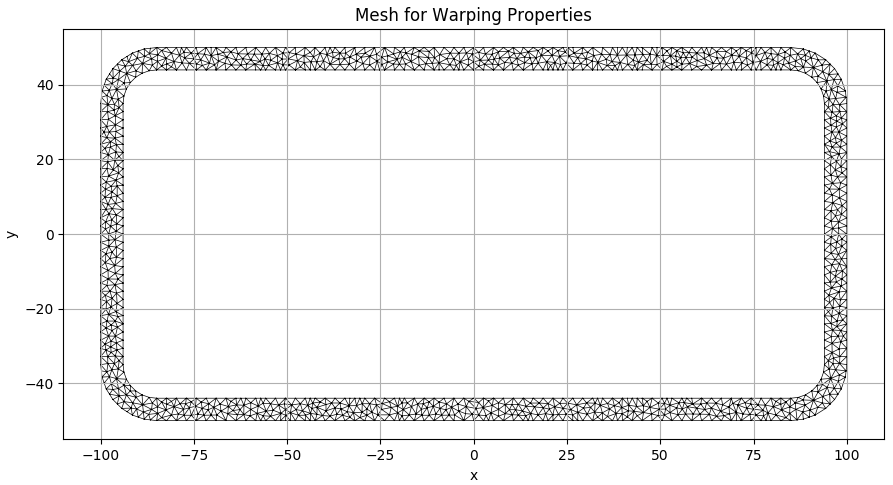
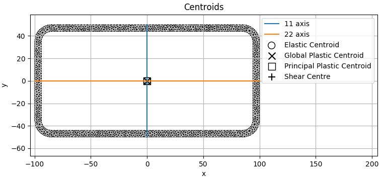
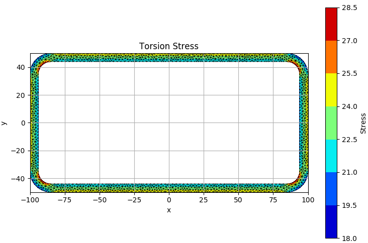
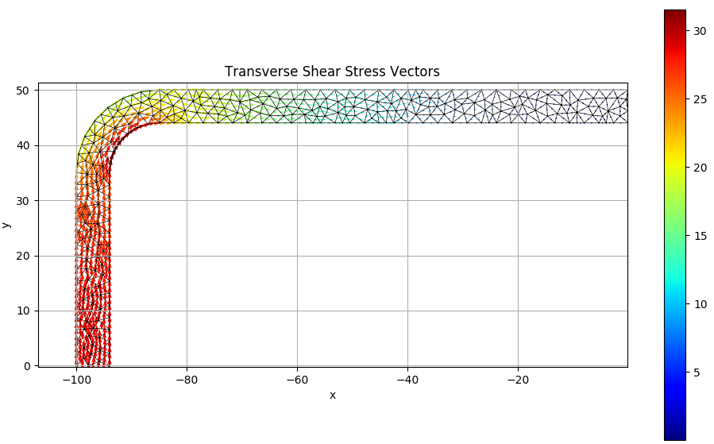
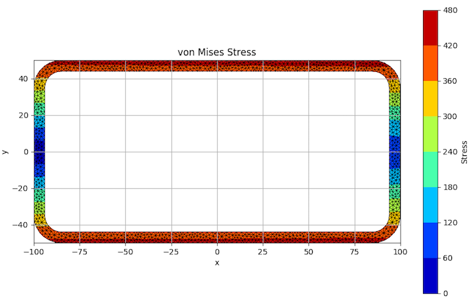

*Note: There will shortly (~2 months) be an updated release of section-properties with improved usability, full documentation and other features for python 3.x (11/08/2018)*

# Cross-Section Analysis in Python

*section-properties* is a python program that analyses an arbitrary cross-section using the finite element method. It outputs properties that can be used in structural design, such as the second moment of area, elastic and plastic section moduli, torsion constant, warping constant, shear centre, shear areas and many more. The program also calculates normal and shear stresses resulting from an acting axial force, bending moments, torsion moment and/or transverse shear forces.

To read more about the theory behind the program, its implementation and some more examples, check out my blog at [https://robbievanleeuwen.github.io/](https://robbievanleeuwen.github.io/).

## Getting Started

These instructions will get you a copy of *section-properties* up and running on your local machine for further development, testing and/or structural analysis purposes.

### Prerequisites

You will need a working installation of python 2.x on your machine. You will also need the *numpy*, *matplotlib* and *meshpy* packages. While most python distributions come pre-installed with *numpy* and *matplotlib*, you will most likely need to obtain *meshpy* yourself. If you are using a UNIX based system (e.g. mac, linux, ubuntu), this can simply be done in the terminal with the pip package installer:

```
$ pip install meshpy
```

However, if you are using a Windows machine, you will need to obtain the appropriate installation file from [this](https://www.lfd.uci.edu/~gohlke/pythonlibs/#meshpy) website. Alternatively, the installation files can be downloaded here: [32bit](https://www.dropbox.com/s/4kmjsc5fm4hgq4m/MeshPy-2016.1.2-cp27-cp27m-win32.whl?dl=0) or [64bit](https://www.dropbox.com/s/y1mg7rxmamryekt/MeshPy-2016.1.2-cp27-cp27m-win_amd64.whl?dl=0).

Once downloading the correct file, the *meshpy* package can be installed by using the pip package installer in your distribution's command line. E.g. if the file is in your Downloads folder:

```
$ cd Downloads
$ pip install MeshPy-2016.1.2-cp27-cp27m-win_amd64.whl
```

If you have any issues regarding the *meshpy* installation, refer to its documentation [here](https://documen.tician.de/meshpy/).

### Installing

*section-properties* can be installed simply by downloading this repository [here](https://github.com/robbievanleeuwen/section-properties/archive/master.zip) or by cloning the master through git:

```
$ git clone https://github.com/robbievanleeuwen/section-properties.git
```

## Running an analysis

Running a cross-section analysis in *section-properties* is as simple as specifying a geometry and a mesh size, and letting the program do the rest of the hard work! An example file is included with the installation, which shows that a cross-section analysis and resulting stress analysis in *section-properties* is as simple as modifying three lines of code! Have a look at the code in the example file and give it a run.

```
$ python example.py
```

### Structure of an analysis script

If you would like to create your own analysis script, you need to place it in the same folder as the rest of the scripts and follow this basic structure:

1) Import the *main* and optionally the *sectionGenerator* modules.
2) Generate a geometry by manually defining the domain, or by using a section generated by the built-in *sectionGenerator*.
3) Perform the cross-section analysis.
4) Optionally, perform a stress analysis.

#### 1) Importing modules:

The following code will import both the *main* and *sectionGenerator* modules:

```python
import main
import sectionGenerator
```

#### 2) Generate a geometry:

Manually generating a geometry involves creating three separate lists of tuple pairs:

* Points list: contains the coordinates of the points defining the geometry.
* Segments list: contains references to the points list and defines the boundaries (facets) of the geometry.
* Holes list: contains the coordinates of any holes in your section.

The below example shows the lists required to create a rectangle, 20 mm wide and 100 mm high:

```python
points = [(0,0), (20,0), (20,100), (0,100)]
facets = [(0,1), (1,2), (2,3), (3,0)]
holes = []
```

Alternatively, you can use one of the built-in sections generated by the *sectionGenerator* module. Have a look at this file and the *sections.py* file to get an overview of the built-in sections. The below example generates a 200 x 100 x 6 RHS (rectangular hollow section) on its side:

```python
(points, facets, holes) = sectionGenerator.RHS(d=100, b=200, t=6, r_out=15, n_r=8)
```

#### 3) Perform the analysis:

To perform the analysis, all you have to do is pass in your geometry, the mesh size (maximum element area) and the Poisson's ratio of the material (defaults to zero) into the *crossSectionAnalysis* function, that lives in the *main* module. Here's a simple example:

```python
mesh = main.crossSectionAnalysis(points, facets, holes, meshSize=2.5, nu=0)
```

Here's an example of the mesh produced by the above lines of code:



And here's a plot showing the principal axes and centroids resulting from the above lines of code, no surprises here:



#### 4) Visualise the cross-section stress:

Once you've performed a cross-section analysis, you can apply some loads to your cross-section and visualise the resulting stress contour and vector plots. Take the mesh object returned by the *crossSectionAnalysis* function and pass it into the *stressAnalysis* function, along with the design actions:

* Nzz = axial force [N]
* Mxx = bending moment about the x-axis [N.mm]
* Myy = bending moment about the y-axis [N.mm]
* M11 = bending moment about principal 11-axis [N.mm]
* M22 = bending moment about principal 22-axis [N.mm]
* Mzz = torsion moment [N.mm]
* Vx = shear force in the x-direction [N]
* Vy = shear force in the x-direction [N]

Here's a simple example:

```python
main.stressAnalysis(mesh, Nzz=10e3, Mxx=50e6, Myy=0, M11=0, M22=0, Mzz=5e6, Vx=0, Vy=30e3)
```

Here are a selection of some plots from the above analysis:

##### Torsion Stress:



##### Transverse Shear Stress Vectors:



##### Von Mises Stress:



Note that multiple stress analyses can be run on the same mesh object.

## Cross-section generators

A number of predefined section shapes have helper functions that build a cross-section for you. Find out more [here](/docs/sectionGenerator.md).

## Property output

An overview of the printed cross-section property output can be found [here](/docs/output.md).

## Author

* **Robbie van Leeuwen**

If you have any issues with the analysis or find any bugs, feel free to raise an issue or drop me an [email](mailto:robbie.vanleeuwen@gmail.com).

## License

This project is licensed under the MIT License - see the [LICENSE](LICENSE) file for details

## Acknowledgments

* This program would not be possible without the [*meshpy*](https://github.com/inducer/meshpy) wrapper, by Andreas Klöckner, which implements the mesh generation software [*Triangle*](http://www.cs.cmu.edu/~quake/triangle.html), by Jonathan Richard Shewchuk.
