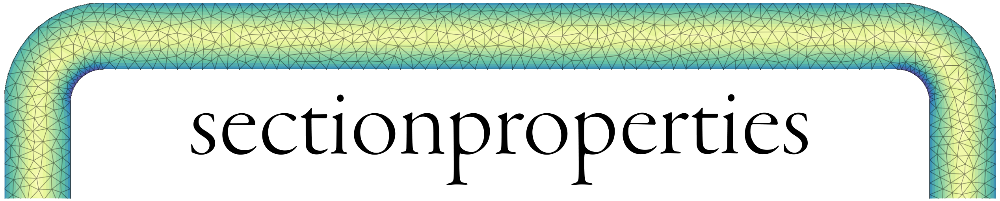
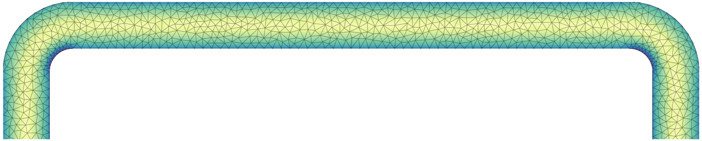

.. toctree::
    :hidden:

    installation
    user_guide
    examples
    api

.. toctree::
    :caption: Development
    :hidden:

    contributing
    Code of Conduct <codeofconduct>
    License <license>
    Changelog <https://github.com/robbievanleeuwen/section-properties/releases>

Documentation
=============

``sectionproperties`` is a python package for the analysis of arbitrary
cross-sections using the finite element method. ``sectionproperties``
can be used to determine section properties to be used in structural
design and visualise cross-sectional stresses resulting from
combinations of applied forces and bending moments.

`Subscribe <http://eepurl.com/dMMUeg>`_ to the ``sectionproperties`` mailing list!

Installation
------------

You can install ``sectionproperties`` via `pip <https://pip.pypa.io/>`_ from
`PyPI <https://pypi.org/>`_:

.. code:: shell

   pip install sectionproperties

See :ref:`label-installation` for more information.

Features
--------

See the complete list of ``sectionproperties`` features :ref:`here<label-features>`.

Contributing
------------

Contributions are very welcome. To learn more, see the
:ref:`Contributor Guide<label-contributing>`.

License
-------

Distributed under the terms of the :doc:`MIT License <license>` ``sectionproperties``
is free and open source software.

Support
-------

Found a bug 🐛, or have a feature request ✨, raise an issue on the
GitHub `issue
tracker <https://github.com/robbievanleeuwen/section-properties/issues>`_.
Alternatively you can get support on the
`discussions <https://github.com/robbievanleeuwen/section-properties/discussions>`_
page.

Disclaimer
----------

``sectionproperties`` is an open source engineering tool that continues to benefit from
the collaboration of many contributors. Although efforts have been made to ensure the
that relevant engineering theories have been correctly implemented, it remains the
user's responsibility to confirm and accept the output. Refer to the
:doc:`License <license>` for clarification of the conditions of use.
