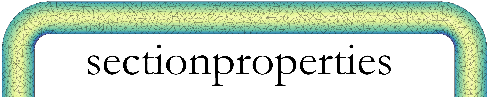

.. sectionproperties documentation master file, created by
   sphinx-quickstart on Wed Jul 11 20:01:55 2018.
   You can adapt this file completely to your liking, but it should at least
   contain the root `toctree` directive.

Documentation
=============

*sectionproperties* is a python package for the analysis of arbitrary cross-sections using the
finite element method written by Robbie van Leeuwen. *sectionproperties* can be used to determine
section properties to be used in structural design and visualise cross-sectional stresses resulting
from combinations of applied forces and bending moments.

A list of the `current features of the package and implementation goals for future releases
<https://github.com/robbievanleeuwen/section-properties/tree/master/README.md>`_
can be found in the README file on github.

.. toctree::
   :maxdepth: 1
   :caption: Contents:

   rst/installation
   rst/structure
   rst/geom_mesh
   rst/analysis
   rst/post
   rst/examples
   rst/api
   rst/theory

Here's a quick example that harnesses some of the power of *sectionproperties* and shows its simplicity::

  import sectionproperties.pre.sections as sections
  from sectionproperties.analysis.cross_section import CrossSection

  # create geometry of the cross-section
  geometry = sections.ISection(d=203, b=133, t_f=7.8, t_w=5.8, r=8.9, n_r=8)

  # generate a finite element mesh
  mesh = geometry.create_mesh(mesh_sizes=[2.5])

  # create a CrossSection object for analysis
  section = CrossSection(geometry, mesh)

  # calculate various cross-section properties
  section.calculate_geometric_properties()
  section.calculate_warping_properties()

  # print some of the calculated section properties
  print(section.get_area())  # cross-section area
  >>>3231.80
  print(section.get_ic())  # second moments of area about the centroidal axis
  >>>(23544664.29, 3063383.07, 0.00)
  print(section.get_j())  # torsion constant
  >>>62907.79
  print(section.get_As())  # shear areas in the x & y directions
  >>>(1842.17, 1120.18)

Support
-------

Contact me on my email robbie.vanleeuwen@gmail.com or raise an issue on the github issue
tracker using one of the `issue templates
<https://github.com/robbievanleeuwen/section-properties/tree/master/.github/ISSUE_TEMPLATE>`_.
If you have a request for a feature to be added to the *sectionproperties* package,
please don't hesitate to get in touch

License
-------

The project is licensed under the MIT license.
