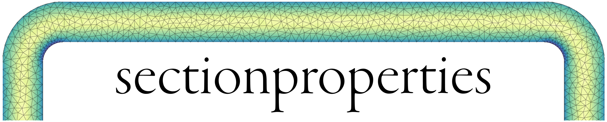

.. sectionproperties documentation master file, created by
   sphinx-quickstart on Wed Jul 11 20:01:55 2018.
   You can adapt this file completely to your liking, but it should at least
   contain the root `toctree` directive.

Documentation
=============

*sectionproperties* is a python package for the analysis of arbitrary cross-sections using the
finite element method written by Robbie van Leeuwen. *sectionproperties* can be used to determine
section properties to be used in structural design and visualise cross-sectional stresses resulting
from combinations of applied forces and bending moments.

A list of the `current features of the package and implementation goals for future releases
<https://github.com/robbievanleeuwen/section-properties/blob/master/README.md>`_
can be found in the README file on github.

.. toctree::
   :maxdepth: 1
   :caption: Contents:

   rst/installation
   rst/structure
   rst/geom_mesh
   rst/analysis
   rst/post
   sphinx_gallery_examples/index
   rst/api
   rst/theory

Here's a quick example that harnesses some of the power of *sectionproperties* and shows its
simplicity.  An I section is analysed and then the area, second moments of area about the centroidal
axis, torsion constant, and shear areas in the x & y directions are printed.

.. jupyter-execute::

   import sectionproperties.pre.sections as sections
   from sectionproperties.analysis.cross_section import CrossSection
   from pprint import pprint as print
   # create geometry of the cross-section
   geometry = sections.ISection(d=203, b=133, t_f=7.8, t_w=5.8, r=8.9, n_r=8)
   # generate a finite element mesh
   mesh = geometry.create_mesh(mesh_sizes=[2.5])
   # create a CrossSection object for analysis
   section = CrossSection(geometry, mesh)
   # calculate various cross-section properties
   section.calculate_geometric_properties()
   section.calculate_warping_properties()

.. jupyter-execute::

   print(section.get_area())

.. jupyter-execute::

   print(section.get_ic())

.. jupyter-execute::

   print(section.get_j())

.. jupyter-execute::

   print(section.get_As())

Support
-------

Contact me on my email robbie.vanleeuwen@gmail.com or raise an issue on the github issue
tracker using one of the `issue templates
<https://github.com/robbievanleeuwen/section-properties/issues/new/choose>`_.
If you have a request for a feature to be added to the *sectionproperties* package,
please don't hesitate to get in touch

License
-------

The project is licensed under the MIT license.
