.. _label-advanced_geom:

Advanced Geometry Creation
==========================

The below tutorial was created to demonstrate the creation of valid geometries
for section analysis by combining multiple shapes.

Some key points to remember:

1. Geometries of two *different* materials should not overlap (can create unpredictable results)
2. If two geometries of the *same* materials are overlapping, then you should perform a union on the two sections
3. Two different section geometries that share a common edge (facet) should also share the same nodes (do not leave "floating" nodes along common edges)

These are general points to remember for any finite element analysis.

.. note::
   *sectionproperties* will not prevent the creation of these ambiguous sections. The flexibility of the new
   pre-processing engine (shapely) allows for a wide variety of intermediate modelling steps but the user must ensure
   that the final model is one that is appropriate for analysis.

Creating Merged Sections
------------------------

For this example, we will create a custom section out of two similar "I" sections::

    import sectionproperties.pre.library.steel_sections as steel_sections
    import sectionproperties.analysis.section as cross_section

    i_sec1 = steel_sections.i_section(d=250, b=150, t_f=13, t_w=10, r=12, n_r=12)
    i_sec2 = i_sec1.rotate_section(45)

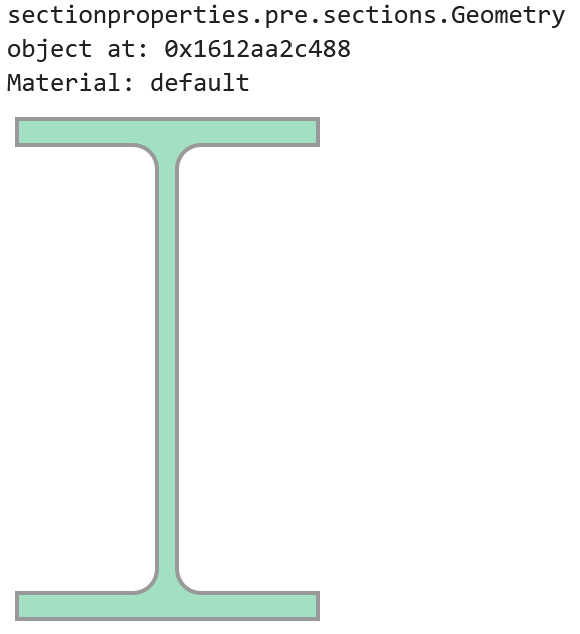

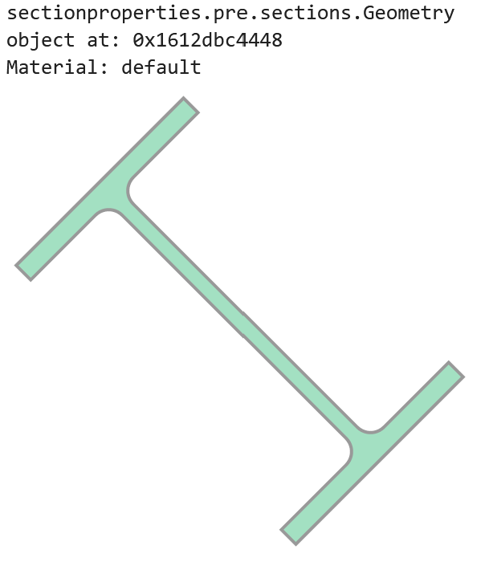

Assign a unique material to each geometry::

    from sectionproperties.pre.pre import Material

    mat1 = Material("Material_1", 200e3, 0.3, 100, 400, "red")
    mat2 = Material("Material_2", 150e3, 0.2, 100, 200, "blue")  # Just some differing properties

    i_sec1.material = mat1
    i_sec2.material = mat2

Now, we can use the ``+`` operator to naively combine these two sections into a :class:`~sectionproperties.pre.geometry.CompoundGeometry`. Note, the two
different materials::

    i_sec1 + i_sec2

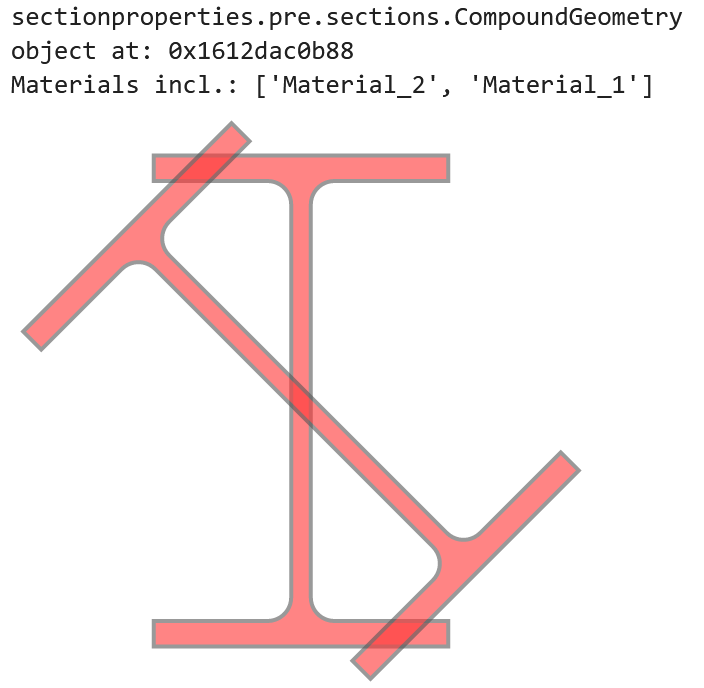

When we plot the geometry, we will see that even though we have two materials, we only have one control point for both geometries::

    (i_sec1 + i_sec2).plot_geometry()

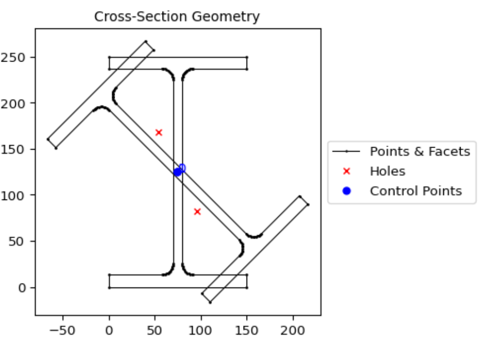

If we went a few steps further by creating a mesh and then plotting that mesh as part of an analysis section, we would see the unpredictable result of the mesh::

    cross_section.Section((i_sec1 + i_sec2).create_mesh([10])).plot_mesh()

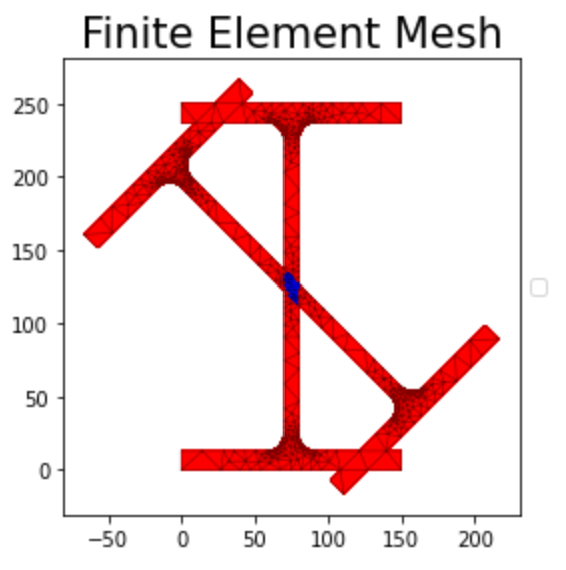

Preventing Ambiguity
--------------------

To prevent ambiguity between geometries and their analytical regions, there are a few options we can take. We can perform a simple union operation but that will lose
the material information for one of our sections: whichever section comes first in the operation will have
it's information preserved. In this example, we will use ``|`` (union)
with ``i_sec2`` taking precedence by being the first object in the operation::

    i_sec2 | i_sec1

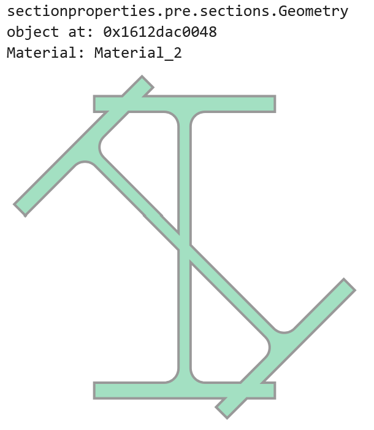

However, this is unsatisfactory as a solution. We want this section to more aptly represent a real section that might be created by cutting and welding two sections together.

Lets say we want the upright "I" section to be our main section and the diagonal section will be added on to it.

It is sometimes possible to do this in a quick operation, one which does not create nodes in common at the intersection points.
Here, we will simply "slice" ``i_sec2`` with ``i_sec1`` and add it to ``i_sec1``. This will create "floating nodes" along the
common edges of ``i_sec2`` and ``i_sec1`` because the nodes are not a part of ``i_sec1``::

    (i_sec2 - i_sec1) + i_sec1

..  figure:: ../images/examples/combined_section_lucky.png
    :align: center
    :scale: 50 %

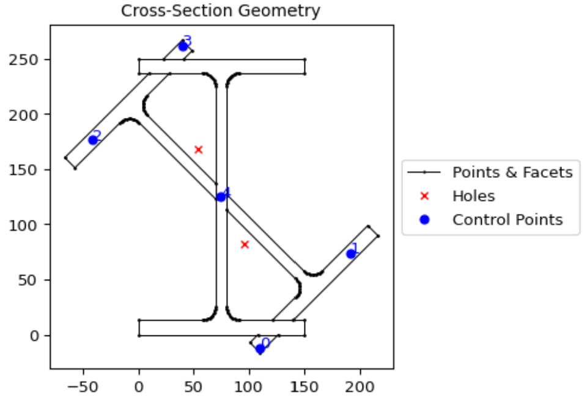

Sometimes, we can get away with this as in this example. We can see in the plot that there are five distinct regions indicated with five control points.

When we are "unlucky", sometimes gaps can be created (due to floating point errors) where the two sections meet and a proper hole might not be detected, resulting
in an incorrect section.

Creating Nodes in Common
------------------------

It is best practice to *first* create nodes in common on both sections and *then* combine them. For this, an extra step is required::

    cut_2_from_1 = (i_sec1 - i_sec2)  # locates intersection nodes
    sec_1_nodes_added = cut_2_from_1 | i_sec1

    # This can also be done in one line
    sec_1_nodes_added = (i_sec1 - i_sec2) | i_sec1

Now, when we use ``.plot_geometry()``, we can see the additional nodes added to "section 1"::

    sec_1_nodes_added.plot_geometry()

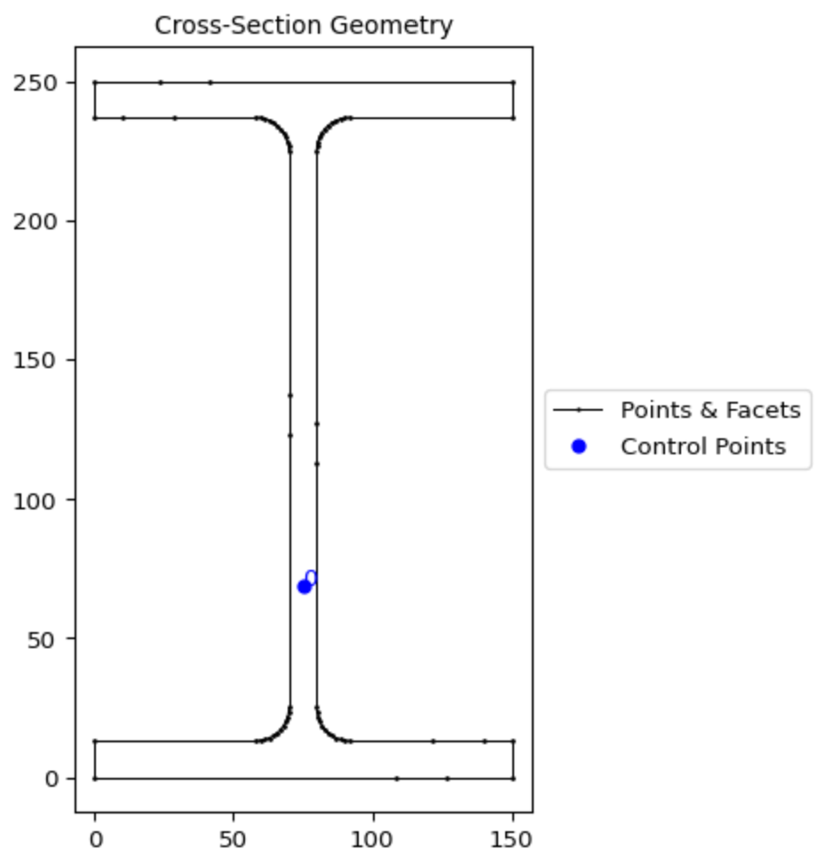

    The additional nodes from the cut portion are now merged as part of the "section 1" geometry.

At this point, we can use our "section 1 with additional nodes" to create our complete geometry::

    analysis_geom = (i_sec2 - i_sec1) + sec_1_nodes_added
    analysis_geom.plot_geometry()

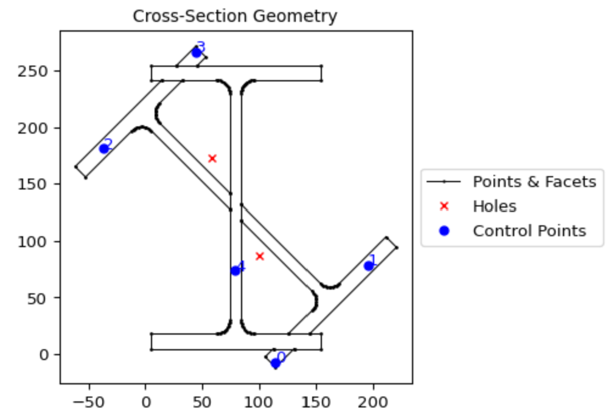

And when we create our mesh and analysis section::

    analysis_geom.create_mesh([10])
    analysis_sec = cross_section.Section(analysis_geom)
    analysis_sec.plot_mesh()

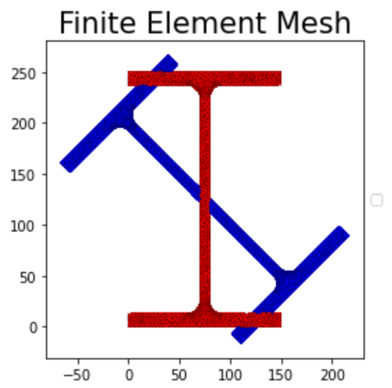

We can see that the mesh represents how we expect the section to be.

Another example
---------------

Here, we will simply combine two squares with the default material::

    import sectionproperties.pre.library.primitive_sections as primitive_sections
    from sectionproperties.analysis.section import Section

    s1 = primitive_sections.rectangular_section(1,1)
    s2 = primitive_sections.rectangular_section(0.5,0.5).shift_section(1,0.25)
    geometry = s1 + s2
    geometry

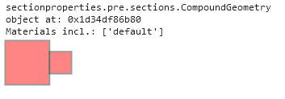

From the shapely vector representation, we can see that the squares are shaded red.
This indicates an `"invalid" geometry from shapely's perspective <https://shapely.readthedocs.io/en/stable/manual.html#polygons>`_
because there are two polygons that share an edge. For this geometry, the intention is to have two squares
that are connected on one side and so the red shading provided by the shapely representation tells us that
we are getting what we expect.

Now, say this is not our final geometry and we actually want to have it rotated by 30 degrees::

    geometry = geometry.rotate_section(30)

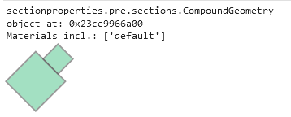

Here, we can see that the shapely representation is now showing as green indicating a "valid" shapely geometry.
Even though it is now valid for shapely, because it is green we know that these two polygons no longer share an edge
because there is a miniscule separation between them as a result of a floating point error.

When we try to mesh this geometry, we will actually cause a crash with triangle, the meshing tool used behind-the-scenes
by sectionproperties::

    geometry.create_mesh(mesh_sizes=[0.2, 0.1]) # This may crash the kernel

The crash occurs because the distance between the two polygons is so small, even though they are separated and
the space between them will not be meshed. The same crash would occur if the polygons were overlapping by this same
small distance.

If we plot the geometry, you can see that each of the two squares has only four nodes and four facets and their relationship
is only incidental. If their edges happen to perfectly align, they will be considered as one continuous section. If their edges
do not perfectly align, they will be considered as discontinuous.

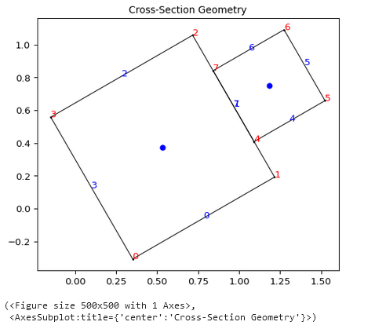

To remedy this, take the same approach as in the preceding example by creating intermediate nodes where the two polygons
intersect by using set operations. If we subtract ``s2`` from ``s1`` then we will have the larger square with intermediate nodes created::

    (s1 - s2).plot_geometry(labels=['points'])

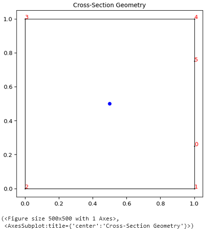

Now, if we build the compound geometry up from this larger square with the intermediate points, then our section will work.::

    geometry_fixed = (s1 - s2) + s2
    geometry_fixed_rotated = geometry_fixed.rotate_section(angle=30)
    geometry_rot.create_mesh(mesh_sizes=[0.2, 0.1])
    geometry_rot.plot_geometry(labels=["points", "facets"])
    section = Section(geometry_rot)
    section.display_mesh_info()

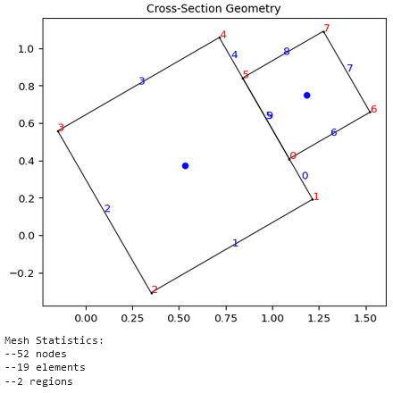

Another example (but with nested geometries)
--------------------------------------------

This example demonstrates creating nested geometries using two different approaches.
These approaches reflect the differences between how shapely (geometry pre-processor) "perceives" geometry
and how Triangle (meshing tool) "perceives" geometry and how the modeller might adapt their
input style depending on the situation.

The nested geometry we are trying to create looks as follows:

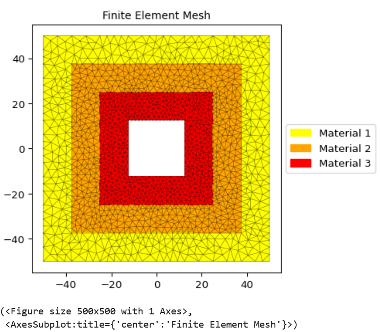

In creating this geometry consider the following:

- shapely has a concept of "z-ordering" where it is possible for one geometry to be "over"
  another geometry and for an overlap section to exist. When a hole is created in a polygon,
  it is only local to that polygon.

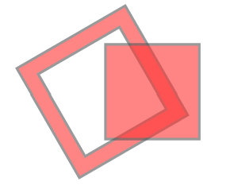

- Triangle does not have a concept of "z-ordering" so there is only a single plane which
  may have regions of different materials (specified with control points). When a hole is created
  in the plane, it "punches" through "all" polygons in the plane.

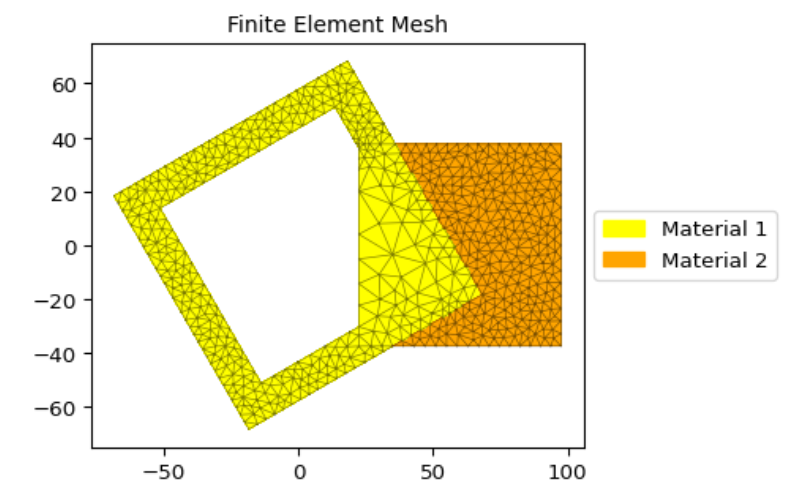

To create the nested geometry using shapely, the code would be as follows::

    mat1 = Material(name="Material 1", elastic_modulus=100, poissons_ratio=0.3, yield_strength=10, density=1e-6, color="yellow")
    mat2 = Material(name="Material 2", elastic_modulus=100, poissons_ratio=0.3, yield_strength=10, density=1e-6, color="orange")
    mat3 = Material(name="Material 3", elastic_modulus=100, poissons_ratio=0.3, yield_strength=10, density=1e-6, color="red")

    sq1 = sections.rectangular_section(100, 100, material=mat1).align_center()
    sq2 = sections.rectangular_section(75, 75, material=mat2).align_center()
    sq3 = sections.rectangular_section(50, 50, material=mat3).align_center()
    hole = sections.rectangular_section(25, 25).align_center()

    compound = (
        (sq1 - sq2) # Create a big square with a medium hole in it and stack it over...
        + (sq2 - sq3) # ... a medium square with a medium-small hole in it and stack it over...
        + (sq3 - hole) # ...a medium-small square with a small hole in it.
    )
    compound

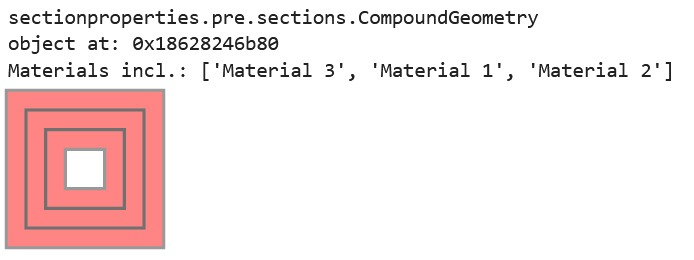

To create the nested geometry using the Triangle interface, the code would be as follows::

    points = [ # Points for four squares are created
        [-50.0, 50.0], # Square 1
        [50.0, 50.0],
        [50.0, -50.0],
        [-50.0, -50.0],
        [37.5, -37.5], # Square 2
        [37.5, 37.5],
        [-37.5, 37.5],
        [-37.5, -37.5],
        [25.0, -25.0], # Square 3
        [25.0, 25.0],
        [-25.0, 25.0],
        [-25.0, -25.0],
        [12.5, -12.5], # Square 4 (hole)
        [12.5, 12.5],
        [-12.5, 12.5],
        [-12.5, -12.5],
    ]

    facets = [ # Facets trace each of the four squares
        [0, 1], # Square 1
        [1, 2],
        [2, 3],
        [3, 0],
        [4, 5], # Square 2
        [5, 6],
        [6, 7],
        [7, 4],
        [8, 9], # Square 3
        [9, 10],
        [10, 11],
        [11, 8],
        [12, 13], # Square 4 (hole)
        [13, 14],
        [14, 15],
        [15, 12],
    ]

    control_points = [[-43.75, 0.0], [-31.25, 0.0], [-18.75, 0.0]] # Three squares
    holes = [[0, 0]]

    nested_compound = CompoundGeometry.from_points(
        points=points, facets=facets, control_points=control_points, holes=holes
    )
    nested_compound

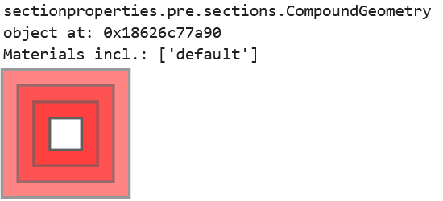

Notice how the shapely representation shows the squares overlapping each other instead of the squares
fitting into the "hole below".

Is one of these methods better than the other? Not necessarily. The shapely approach is suitable
for manually creating the geometry whereas the Triangle approach is suitable for reading in serialized
data from a file, for example.

And, for either case, when the compound geometry is meshed, we see this:

