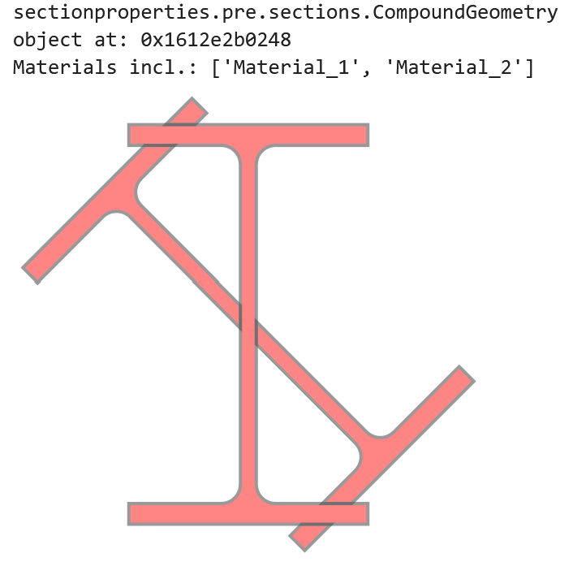

.. _label-advanced_geom:

Advanced Geometry Creation
==========================

The below tutorial was created to demonstrate the creation of valid geometries
for section analysis by combining multiple shapes.

Some key points to remember:

1. Geometries of two *different* materials should not overlap (can create unpredictable results)
2. If two geometries of the *same* materials are overlapping, then you should perform a union on the two sections
3. Two different section geometries that share a common edge (facet) should also share the same nodes (do not leave "floating" nodes along common edges)

These are general points to remember for any finite element analysis.

.. note::
   *sectionproperties* will not prevent the creation of these ambiguous sections. The flexibility of the new
   pre-processing engine (shapely) allows for a wide variety of intermediate modelling steps but the user must ensure
   that the final model is one that is appropriate for analysis.

Creating Merged Sections
------------------------

For this example, we will create a custom section out of two similar "I" sections::

    import sectionproperties.pre.sections as sections
    import sectionproperties.analysis.cross_section as cross_section

    i_sec1 = sections.i_section(d=250, b=150, t_f=13, t_w=10, r=12, n_r=12)
    i_sec2 = i_sec1.rotate_section(45)

..  figure:: ../images/examples/i_sec2.png
    :align: center
    :scale: 50 %

Assign a unique material to each geometry::

    from sectionproperties.pre.pre import Material

    mat1 = Material("Material_1", 200e3, 0.3, 400, "red")
    mat2 = Material("Material_2", 150e3, 0.2, 200, "blue")  # Just some differing properties

    i_sec1.material = mat1
    i_sec2.material = mat2

Now, we can use the ``+`` operator to naively combine these two sections into a :class:`~sectionproperties.pre.sections.CompoundGeometry`. Note, the two
different materials::

    i_sec1 + i_sec2

When we plot the geometry, we will see that even though we have two materials, we only have one control point for both geometries::

    (i_sec1 + i_sec2).plot_geometry()

..  figure:: ../images/examples/basic_compound_plot.png
    :align: center
    :scale: 50 %

If we went a few steps further by creating a mesh and then plotting that mesh as part of an analysis section, we would see the unpredictable result of the mesh::

    cross_section.Section((i_sec1 + i_sec2).create_mesh([10])).plot_mesh()

..  figure:: ../images/examples/basic_combined_mesh_error.png
    :align: center
    :scale: 50 %

Preventing Ambiguity
--------------------

To prevent ambiguity between geometries and their analytical regions, there are a few options we can take. We can perform a simple union operation but that will lose
the material information for one of our sections, whichever section comes first in the operation. In this example, we will use ``|`` (union)
with ``i_sec2`` taking precedence by being the first object in the operation::

    i_sec2 | i_sec1

However, this is unsatisfactory as a solution. We want this section to more aptly represent a real section that might be created by cutting and welding two sections together.

Lets say we want the upright "I" section to be our main section and the diagonal section will be added on to it.

It is sometimes possible to do this in a quick operation, one which does not create nodes in common at the intersection points.
Here, we will simply "slice" ``i_sec2`` with ``i_sec1`` and add it to ``i_sec1``. This will create "floating nodes" along the
common edges of ``i_sec2`` and ``i_sec1`` because the nodes are not a part of ``i_sec1``::

    (i_sec2 - i_sec1) + i_sec1

..  figure:: ../images/examples/combined_section_lucky_plot.png
    :align: center
    :scale: 50 %

Sometimes, we can get away with this as in this example. We can see in the plot that there are five distinct regions indicated with five control points.

When we are "unlucky", sometimes gaps can be created (due to floating point errors) where the two sections meet and a proper hole might not be detected, resulting
in an incorrect section.

Creating Nodes in Common
------------------------

It is best practice to *first* create nodes in common on both sections and *then* combine them. For this, an extra step is required::

    cut_2_from_1 = (i_sec1 - i_sec2)  # locates intersection nodes
    sec_1_nodes_added = cut_2_from_1 | i_sec1

    # This can also be done in one line
    sec_1_nodes_added = (i_sec1 - i_sec2) | i_sec1

Now, when we use ``.plot_geometry()``, we can see the additional nodes added to "section 1"::

    sec_1_nodes_added.plot_geometry()

..  figure:: ../images/examples/sec1_nodes_added.png
    :align: center
    :scale: 50 %

    The additional nodes from the cut portion are now merged as part of the "section 1" geometry.

At this point, we can use our "section 1 with additional nodes" to create our complete geometry::

    analysis_geom = (i_sec2 - i_sec1) + sec_1_nodes_added
    analysis_geom.plot_geometry()

..  figure:: ../images/examples/combined_section_common_nodes.png
    :align: center
    :scale: 50 %

And when we create our mesh and analysis section::

    analysis_geom.create_mesh([10])
    analysis_sec = cross_section.Section(analysis_geom)
    analysis_sec.plot_mesh()

We can see that the mesh represents how we expect the section to be.
