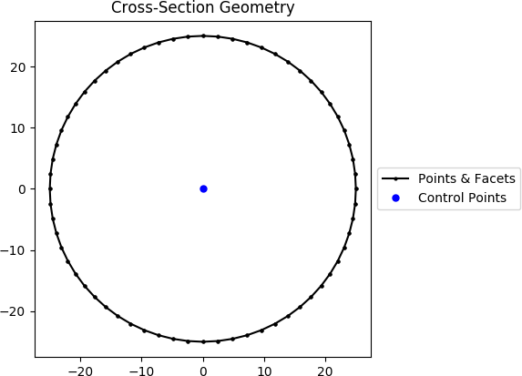
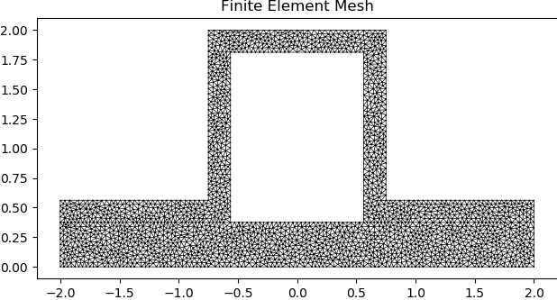
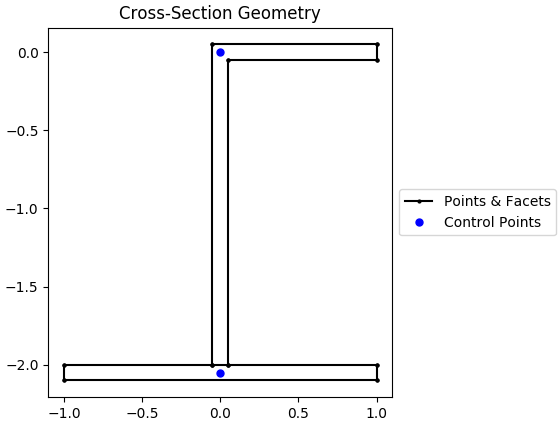
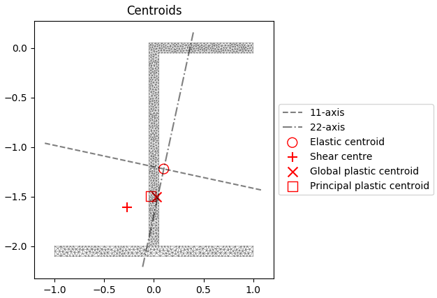
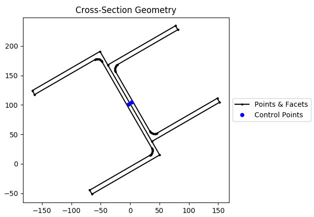
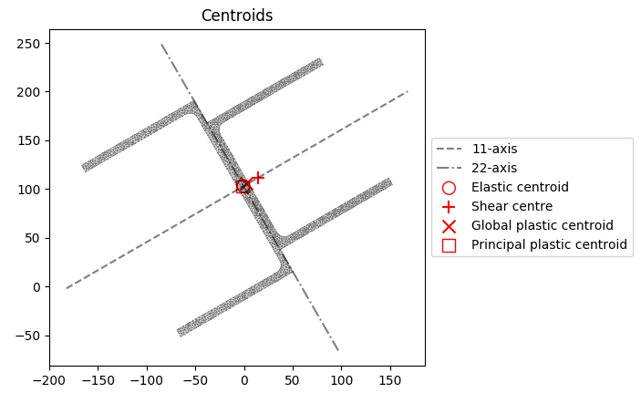
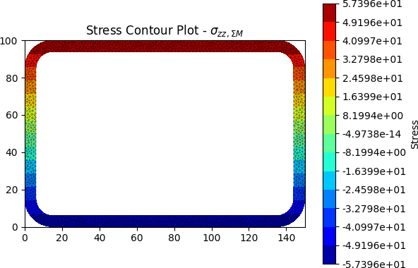
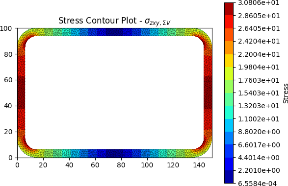
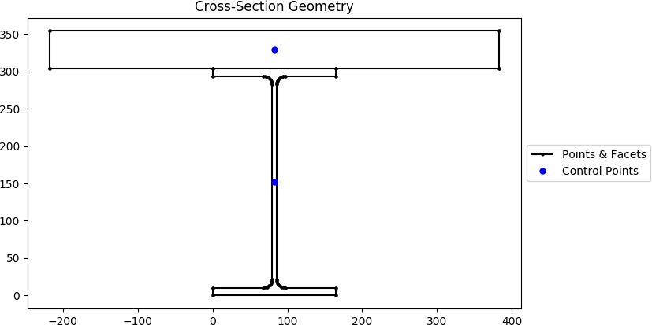
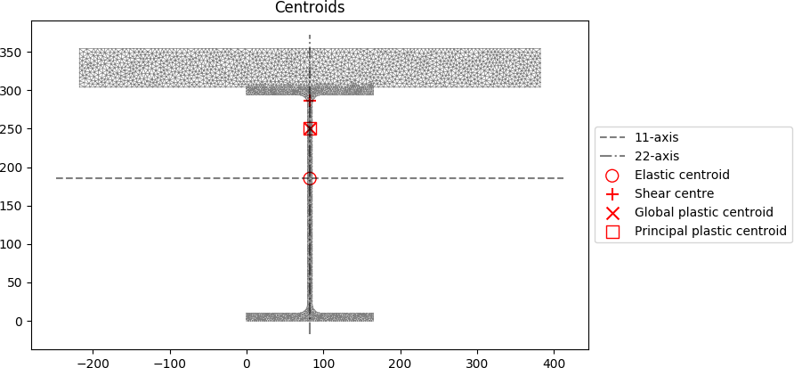

.. _label-examples:

Examples
========

The following examples are located in the ``sectionproperties.examples``
package.

Simple Example
--------------

The following example calculates the geometric, warping and plastic properties
of a 50 mm diameter circle. The circle is discretised with 64 points and a mesh
size of 2.5 mm\ :sup:`2`.

The geometry and mesh are plotted, and the mesh information printed to the terminal
before the analysis is carried out. Detailed time information is printed to the
terminal during the cross-section analysis stage. Once the analysis is complete,
the cross-section properties are printed to the terminal. The centroidal
axis second moments of area and torsion constant are saved to variables and it
is shown that, for a circle, the torsion constant is equal to the sum of the
second moments of area:

.. literalinclude:: ../../../sectionproperties/examples/example_simple.py

The following plots are generated by the above example:

    Circular section geometry.

..  figure:: ../images/sections/circle_mesh.png
    :align: center
    :scale: 75 %

    Mesh generated from the above geometry.

The following is printed to the terminal:

.. code-block:: text

  --Initialising the Section class...
  ----completed in 0.038872 seconds---

  Mesh Statistics:
  --2551 nodes
  --1242 elements
  --1 region

  --Calculating geometric section properties...
  ----completed in 1.260965 seconds---

  --Assembling 2551x2551 stiffness matrix and load vector...
  ----completed in 1.481895 seconds---

  --Solving for the warping function using the direct solver...
  ----completed in 0.027327 seconds---

  --Computing the torsion constant...
  ----completed in 0.000417 seconds---

  --Assembling shear function load vectors...
  ----completed in 1.592697 seconds---

  --Solving for the shear functions using the direct solver...
  ----completed in 0.155810 seconds---

  --Assembling shear centre and warping moment integrals...
  ----completed in 0.986702 seconds---

  --Calculating shear centres...
  ----completed in 0.000075 seconds---

  --Assembling shear deformation coefficients...
  ----completed in 1.506942 seconds---

  --Assembling monosymmetry integrals...
  ----completed in 1.298219 seconds---

  --Calculating plastic properties...
  ----completed in 0.045805 seconds---

  Section Properties:
  A        = 1.960343e+03
  Perim.   = 1.570166e+02
  Qx       = -7.673862e-13
  Qy       = 9.795276e-12
  cx       = 4.996716e-15
  cy       = -3.914551e-16
  Ixx_g    = 3.058119e+05
  Iyy_g    = 3.058119e+05
  Ixy_g    = -1.800515e-11
  Ixx_c    = 3.058119e+05
  Iyy_c    = 3.058119e+05
  Ixy_c    = -1.800515e-11
  Zxx+     = 1.223248e+04
  Zxx-     = 1.223248e+04
  Zyy+     = 1.223248e+04
  Zyy-     = 1.223248e+04
  rx       = 1.248996e+01
  ry       = 1.248996e+01
  phi      = 0.000000e+00
  I11_c    = 3.058119e+05
  I22_c    = 3.058119e+05
  Z11+     = 1.223248e+04
  Z11-     = 1.223248e+04
  Z22+     = 1.223248e+04
  Z22-     = 1.223248e+04
  r11      = 1.248996e+01
  r22      = 1.248996e+01
  J        = 6.116234e+05
  Iw       = 3.047221e-02
  x_se     = 6.104251e-06
  y_se     = -5.509926e-06
  x_st     = 6.104251e-06
  y_st     = -5.509926e-06
  x1_se    = 6.104251e-06
  y2_se    = -5.509926e-06
  A_sx     = 1.680296e+03
  A_sy     = 1.680296e+03
  A_s11    = 1.680296e+03
  A_s22    = 1.680296e+03
  betax+   = -1.101985e-05
  betax-   = 1.101985e-05
  betay+   = 1.220850e-05
  betay-   = -1.220850e-05
  beta11+  = -1.101985e-05
  beta11-  = 1.101985e-05
  beta22+  = 1.220850e-05
  beta22-  = -1.220850e-05
  x_pc     = 4.996716e-15
  y_pc     = -3.914551e-16
  Sxx      = 2.078317e+04
  Syy      = 2.078317e+04
  SF_xx+   = 1.699016e+00
  SF_xx-   = 1.699016e+00
  SF_yy+   = 1.699016e+00
  SF_yy-   = 1.699016e+00
  x11_pc   = 4.996716e-15
  y22_pc   = -3.914551e-16
  S11      = 2.078317e+04
  S22      = 2.078317e+04
  SF_11+   = 1.699016e+00
  SF_11-   = 1.699016e+00
  SF_22+   = 1.699016e+00
  SF_22-   = 1.699016e+00

  Ixx + Iyy = 611623.837
  J = 611623.434

Creating a Nastran Section
--------------------------

The following example demonstrates how to create a cross-section defined in
a Nastran-based finite element analysis program. The following creates a
HAT1 cross-section and calculates the geometric, warping and plastic properties.
The HAT1 cross-section is meshed with a maximum elemental area of 0.005.

The geometry and mesh are plotted, and the mesh information printed to the terminal
before the analysis is carried out. Detailed time information is printed to the
terminal during the cross-section analysis stage. Once the analysis is complete,
the cross-section properties are printed to the terminal. The centroidal
axis second moments of area and torsion constant are saved to variables and it
is shown that, for non-circular sections, the torsion constant is not equal to the
sum of the second moments of area:

.. literalinclude:: ../../../sectionproperties/examples/example_nastran_section.py

The following plots are generated by the above example:

..  figure:: ../images/sections/hat1_geometry.png
    :align: center
    :scale: 75 %

    Circular section geometry.

    Mesh generated from the above geometry.

The following is printed to the terminal:

.. code-block:: text

    --Initialising the Section class...
    ----completed in 0.024897 seconds---

    Mesh Statistics:
    --2038 nodes
    --926 elements
    --2 regions

    --Calculating geometric section properties...
    ----completed in 1.114218 seconds---

    --Assembling 2038x2038 stiffness matrix and load vector...
    ----completed in 1.197176 seconds---

    --Solving for the warping function using the direct solver...
    ----completed in 0.010403 seconds---

    --Computing the torsion constant...
    ----completed in 0.000427 seconds---

    --Assembling shear function load vectors...
    ----completed in 1.201218 seconds---

    --Solving for the shear functions using the direct solver...
    ----completed in 0.112085 seconds---

    --Assembling shear centre and warping moment integrals...
    ----completed in 0.762330 seconds---

    --Calculating shear centres...
    ----completed in 0.000067 seconds---

    --Assembling shear deformation coefficients...
    ----completed in 1.134287 seconds---

    --Assembling monosymmetry integrals...
    ----completed in 0.880405 seconds---

    --Calculating plastic properties...
    ----completed in 0.081270 seconds---

    Section Properties:
    A        = 2.789062e+00
    Perim.   = 1.200000e+01
    Qx       = 1.626709e+00
    Qy       = -9.714451e-17
    cx       = -3.483053e-17
    cy       = 5.832458e-01
    Ixx_g    = 1.935211e+00
    Iyy_g    = 3.233734e+00
    Ixy_g    = -2.684485e-16
    Ixx_c    = 9.864400e-01
    Iyy_c    = 3.233734e+00
    Ixy_c    = -2.117893e-16
    Zxx+     = 6.962676e-01
    Zxx-     = 1.691294e+00
    Zyy+     = 1.616867e+00
    Zyy-     = 1.616867e+00
    rx       = 5.947113e-01
    ry       = 1.076770e+00
    phi      = -9.000000e+01
    I11_c    = 3.233734e+00
    I22_c    = 9.864400e-01
    Z11+     = 1.616867e+00
    Z11-     = 1.616867e+00
    Z22+     = 1.691294e+00
    Z22-     = 6.962676e-01
    r11      = 1.076770e+00
    r22      = 5.947113e-01
    J        = 9.878443e-01
    Iw       = 1.160810e-01
    x_se     = 4.822719e-05
    y_se     = 4.674792e-01
    x_st     = 4.822719e-05
    y_st     = 4.674792e-01
    x1_se    = 1.157666e-01
    y2_se    = 4.822719e-05
    A_sx     = 1.648312e+00
    A_sy     = 6.979733e-01
    A_s11    = 6.979733e-01
    A_s22    = 1.648312e+00
    betax+   = -2.746928e-01
    betax-   = 2.746928e-01
    betay+   = 9.645438e-05
    betay-   = -9.645438e-05
    beta11+  = 9.645438e-05
    beta11-  = -9.645438e-05
    beta22+  = 2.746928e-01
    beta22-  = -2.746928e-01
    x_pc     = -3.483053e-17
    y_pc     = 3.486328e-01
    Sxx      = 1.140530e+00
    Syy      = 2.603760e+00
    SF_xx+   = 1.638062e+00
    SF_xx-   = 6.743533e-01
    SF_yy+   = 1.610373e+00
    SF_yy-   = 1.610373e+00
    x11_pc   = 3.194355e-16
    y22_pc   = 3.486328e-01
    S11      = 1.500000e+00
    S22      = 1.140530e+00
    SF_11+   = 9.277198e-01
    SF_11-   = 9.277198e-01
    SF_22+   = 6.743533e-01
    SF_22-   = 1.638062e+00

    Ixx + Iyy = 4.220
    J = 0.988

.. _label-example-custom:

Creating Custom Geometry
------------------------

The following example demonstrates how geometry objects can be created from a
list of points, facets, holes and control points. An straight angle section with
a plate at its base is created from a list of points and facets. The bottom plate
is assigned a separate control point meaning two discrete regions are created.
Creating separate regions allows the user to control the mesh size in each region
and assign material properties to different regions. The geometry is cleaned to
remove the overlapping facet at the junction of the angle and the plate. A
geometric, warping and plastic analysis is then carried out.

The geometry and mesh are plotted before the analysis is carried out. Once the
analysis is complete, a plot of the various calculated centroids is generated:

.. literalinclude:: ../../../sectionproperties/examples/example_custom.py

The following plots are generated by the above example:

    Plot of the generated geometry object.

..  figure:: ../images/examples/custom_mesh.png
    :align: center
    :scale: 75 %

    Mesh generated from the above geometry.

    Plot of the centroids and the principal axis.

Creating a Built-Up Section
---------------------------

The following example demonstrates how to combine multiple geometry objects into
a single geometry object. A 150x100x6 RHS is modelled with a solid 50x50 triangular
section on its top and a 100x100x6 angle section on its right side.
The three geometry objects are combined together as a :class:`~sectionproperties.pre.sections.CompoundGeometry`
object using the `+` operator.

To manipulate individual geometries into the final shape, there are a variety of
methods available to move and align. This example uses `.align_center()`, `.align_to()`,
and `.shift_section()`.

The geometry and mesh are plotted, and the mesh information printed to the terminal
before the analysis is carried out. Detailed time information is printed to the
terminal during the cross-section analysis stage. Once the analysis is complete,
the centroids are plotted:

.. literalinclude:: ../../../sectionproperties/examples/example_merged.py

The following plots are generated by the above example:

..  figure:: ../images/examples/merged_geometry.png
    :align: center
    :scale: 75 %

    Plot of the generated geometry object.

..  figure:: ../images/examples/merged_mesh.png
    :align: center
    :scale: 75 %

    Mesh generated from the above geometry.

..  figure:: ../images/examples/merged_centroids.png
    :align: center
    :scale: 75 %

    Plot of the centroids and the principal axis.

The following is printed to the terminal:

.. code-block:: text
  
  --Initialising the Section class...
  ----completed in 0.091317 seconds---

  Mesh Statistics:
  --6011 nodes
  --2731 elements
  --3 regions

  --Calculating geometric section properties...
  ----completed in 2.702003 seconds---

  --Assembling 6011x6011 stiffness matrix and load vector...
  ----completed in 3.489440 seconds---

  --Solving for the warping function using the direct solver...
  ----completed in 0.034901 seconds---

  --Computing the torsion constant...
  ----completed in 0.000429 seconds---

  --Assembling shear function load vectors...
  ----completed in 3.368087 seconds---

  --Solving for the shear functions using the direct solver...
  ----completed in 0.771342 seconds---

  --Assembling shear centre and warping moment integrals...
  ----completed in 2.110939 seconds---

  --Calculating shear centres...
  ----completed in 0.000117 seconds---

  --Assembling shear deformation coefficients...
  ----completed in 3.224420 seconds---

  --Assembling monosymmetry integrals...
  ----completed in 2.396550 seconds---

  --Calculating plastic properties...
  d = -91.996268369166; f_norm = 1.0
  d = 108.003731630834; f_norm = -1.0
  d = 8.003731630833997; f_norm = -0.044339034426850756
  d = 3.561094185178564; f_norm = -0.01325774535805933
  d = 1.693456316638782; f_norm = -0.00019149964749110303
  d = 1.6662075470834101; f_norm = -8.635909415655325e-07
  d = 1.6660841169315574; f_norm = -5.6998751249653636e-11
  d = 1.666082783889499; f_norm = 9.269142902319156e-09
  ---x-axis plastic centroid calculation converged at 1.66608e+00 in 7 iterations.
  d = -67.409490017714; f_norm = 1.0
  d = 132.590509982286; f_norm = -1.0
  d = 32.590509982285994; f_norm = -0.5463797833977765
  d = -17.409490017714006; f_norm = 0.2268101083011118
  d = -2.7423228226828975; f_norm = -0.043022470763645994
  d = -5.080875765477451; f_norm = -0.011205909614761601
  d = -5.8657449981451; f_norm = 0.0004252464243549222
  d = -5.837049412456486; f_norm = -8.433780150836358e-06
  d = -5.837607455591688; f_norm = -6.1029467120133985e-09
  d = -5.837610874395416; f_norm = 4.5529245953218624e-08
  ---y-axis plastic centroid calculation converged at -5.83761e+00 in 9 iterations.
  d = -106.16681282996596; f_norm = -1.0
  d = 113.67282241178034; f_norm = 1.0
  d = 3.753004790907198; f_norm = 0.0394368943465989
  d = -0.5886438731991301; f_norm = 0.006410315748602508
  d = -1.4248809343866293; f_norm = 4.9126448281951345e-05
  d = -1.4313306978320337; f_norm = 6.360698623112342e-08
  d = -1.4313390594741031; f_norm = 6.350574855884941e-13
  d = -1.4313402751436328; f_norm = -9.246866930979412e-09
  ---11-axis plastic centroid calculation converged at -1.43134e+00 in 7 iterations.
  d = -96.43010376150569; f_norm = -1.0
  d = 93.41518522403143; f_norm = 1.0
  d = -1.5074592687371364; f_norm = 0.24999344301692392
  d = -26.81941205069332; f_norm = -0.5136606142451562
  d = -9.793701141307155; f_norm = 0.06969393886809204
  d = -12.614043035926176; f_norm = -0.015439988274397977
  d = -12.102542542006434; f_norm = 0.0009283409099101335
  d = -12.131552640019379; f_norm = 1.1002850185374988e-05
  d = -12.131900348758727; f_norm = -1.890170924873102e-10
  d = -12.131893782808552; f_norm = 2.075883878483105e-07
  ---22-axis plastic centroid calculation converged at -1.21319e+01 in 9 iterations.
  ----completed in 0.233063 seconds---

Mirroring and Rotating Geometry
-------------------------------

The following example demonstrates how geometry objects can be mirrored and
rotated. A 200PFC and 150PFC are placed back-to-back by using the
:func:`~sectionproperties.pre.sections.Geometry.mirror_section` method and are
rotated counter-clockwise by 30 degrees by using the
:func:`~sectionproperties.pre.sections.Geometry.rotate_section` method. The
geometry is cleaned to ensure there are no overlapping facets along the junction
between the two PFCs. A geometric, warping and plastic analysis is then carried out.

The geometry and mesh are plotted, and the mesh information printed to the terminal
before the analysis is carried out. Detailed time information is printed to the
terminal during the cross-section analysis stage and iteration information printed
for the plastic analysis. Once the analysis is complete, a plot of the various
calculated centroids is generated:

.. literalinclude:: ../../../sectionproperties/examples/example_mirr_rot.py

The following plots are generated by the above example:

    Plot of the generated geometry object.

..  figure:: ../images/examples/mirr_rot_mesh.png
    :align: center
    :scale: 75 %

    Mesh generated from the above geometry.

    Plot of the centroids and the principal axis.

The following is printed to the terminal:

.. code-block:: text

  --Initialising the Section class...
  ----completed in 0.056139 seconds---

  Mesh Statistics:
  --4834 nodes
  --2149 elements
  --2 regions
  
  --Calculating geometric section properties...
  ----completed in 2.234246 seconds---
  
  --Assembling 4834x4834 stiffness matrix and load vector...
  ----completed in 2.589639 seconds---
  
  --Solving for the warping function using the direct solver...
  ----completed in 0.015142 seconds---
  
  --Computing the torsion constant...
  ----completed in 0.000308 seconds---

  --Assembling shear function load vectors...
  ----completed in 2.699799 seconds---
  
  --Solving for the shear functions using the direct solver...
  ----completed in 0.888718 seconds---
  
  --Assembling shear centre and warping moment integrals...
  ----completed in 1.697982 seconds---

  --Calculating shear centres...
  ----completed in 0.000112 seconds---

  --Assembling shear deformation coefficients...
  ----completed in 2.597436 seconds---

  --Assembling monosymmetry integrals...
  ----completed in 1.909021 seconds---

  --Calculating plastic properties...
  d = -154.328341319364; f_norm = 1.0
  d = 131.52514244859; f_norm = -1.0
  d = -11.401599435386998; f_norm = 0.13458389687111574
  d = 5.5523146320385806; f_norm = -0.021090896125660206
  d = 3.2553901676723576; f_norm = -0.004055963678924033
  d = 2.7244991942444274; f_norm = 0.00045100079081521416
  d = 2.777624141303641; f_norm = -9.631031338033742e-06
  d = 2.7765133886257933; f_norm = -2.1922913313647594e-08
  d = 2.7765108545976647; f_norm = 5.155596570817187e-15
  ---x-axis plastic centroid calculation converged at 2.77651e+00 in 8 iterations.
  d = -165.804528212969; f_norm = 1.0
  d = 152.808229193691; f_norm = -1.0
  d = -6.498149509638978; f_norm = 0.12894151075699728
  d = 11.696951784368771; f_norm = -0.11748181846162364
  d = 3.0224744372298975; f_norm = -1.4943758176281696e-16
  d = 3.022472425992679; f_norm = 2.7238967591257107e-08
  ---y-axis plastic centroid calculation converged at 3.02247e+00 in 5 iterations.
  d = -101.50000000000063; f_norm = -1.0
  d = 101.50000000000055; f_norm = 1.0
  d = -4.263256414560601e-14; f_norm = 1.7932509811538037e-15
  d = -5.000000426325854e-07; f_norm = -1.9059753355794587e-09
  ---11-axis plastic centroid calculation converged at -4.26326e-14 in 3 iterations.
  d = -133.14647432951358; f_norm = -0.9999999999999997
  d = 132.85352567048616; f_norm = 0.9999999999999991
  d = -0.1464743295136941; f_norm = -0.05050838948742093
  d = 6.248158849098746; f_norm = 0.3421731433506274
  d = 0.6760309227201761; f_norm = 0.004360272672374726
  d = 0.6106685276292333; f_norm = 1.6438133993909877e-15
  d = 0.6106677222949695; f_norm = -5.3723198135382203e-08
  ---22-axis plastic centroid calculation converged at 6.10669e-01 in 6 iterations.
  ----completed in 0.112596 seconds---

Performing a Stress Analysis
----------------------------

The following example demonstrates how a stress analysis can be performed on a
cross-section. A 150x100x6 RHS is modelled on its side with a maximum mesh area
of 2 mm\ :sup:`2`. The pre-requisite geometric and warping analyses are performed
before two separate stress analyses are undertaken. The first combines bending
and shear about the x-axis with a torsion moment and the second combines bending
and shear about the y-axis with a torsion moment.

After the analysis is performed, various plots of the stresses are generated:

.. literalinclude:: ../../../sectionproperties/examples/example_stress.py

The following plots are generated by the above example:

    Contour plot of the bending stress for case 1.

..  figure:: ../images/examples/stress_mzz.png
    :align: center
    :scale: 75 %

    Vector plot of the torsion stress for case 1.

    Contour plot of the shear stress for case 2.

..  figure:: ../images/examples/stress_vm1.png
    :align: center
    :scale: 75 %

    Contour plot of the von Mises stress for case 1.

..  figure:: ../images/examples/stress_vm2.png
    :align: center
    :scale: 75 %

    Contour plot of the von Mises stress for case 2.

Creating a Composite Section
----------------------------

The following example demonstrates how to create a composite cross-section by assigning
different material properties to various regions of the mesh. A steel 310UB40.4 is modelled
with a 50Dx600W timber panel placed on its top flange.

The geometry and mesh are plotted, and the mesh information printed to the terminal
before the analysis is carried out. All types of cross-section analyses are carried
out, with an axial force, bending moment and shear force applied during the stress
analysis. Once the analysis is complete, the cross-section properties are printed
to the terminal and a plot of the centroids and cross-section stresses generated:

.. literalinclude:: ../../../sectionproperties/examples/example_composite.py

The following plots are generated by the above example:

    Plot of the generated geometry object.

..  figure:: ../images/examples/composite_mesh.png
    :align: center
    :scale: 75 %

    Mesh generated from the above geometry.

    Plot of the centroids and the principal axis.

..  figure:: ../images/examples/composite_stress_n.png
    :align: center
    :scale: 75 %

    Contour plot of the axial stress.

..  figure:: ../images/examples/composite_stress_m.png
    :align: center
    :scale: 75 %

    Contour plot of the bending stress.

..  figure:: ../images/examples/composite_stress_v.png
    :align: center
    :scale: 75 %

    Contour plot of the shear stress.

The following is printed to the terminal:

.. code-block:: text

  --Initialising the Section class...
  ----completed in 0.111628 seconds---

  Mesh Statistics:
  --9083 nodes
  --4246 elements
  --2 regions

  --Calculating geometric section properties...
  ----completed in 4.013874 seconds---

  --Assembling 9083x9083 stiffness matrix and load vector...
  ----completed in 6.858416 seconds---

  --Solving for the warping function using the direct solver...
  ----completed in 0.051548 seconds---

  --Computing the torsion constant...
  ----completed in 0.000448 seconds---

  --Assembling shear function load vectors...
  ----completed in 5.352823 seconds---

  --Solving for the shear functions using the direct solver...
  ----completed in 0.099226 seconds---

  --Assembling shear centre and warping moment integrals...
  ----completed in 3.299663 seconds---

  --Calculating shear centres...
  ----completed in 0.000090 seconds---

  --Assembling shear deformation coefficients...
  ----completed in 5.047632 seconds---

  --Assembling monosymmetry integrals...
  ----completed in 3.578162 seconds---

  --Calculating plastic properties...
  d = -302.805418032605; f_norm = 1.0
  d = 51.194581967395; f_norm = -1.0
  d = -125.80541803260499; f_norm = 0.13960518846748118
  d = -104.12236621009279; f_norm = 0.09834238205180504
  d = -57.071824630650035; f_norm = 0.008805290832496693
  d = -52.774443783611176; f_norm = 0.0006273832465500236
  d = -52.44707091309856; f_norm = 4.3932960449216925e-06
  d = -52.444763456895195; f_norm = 2.2112745536221906e-09
  d = -52.44473673451347; f_norm = -4.8641367015212453e-08
  ---x-axis plastic centroid calculation converged at -5.24448e+01 in 8 iterations.
  d = -300.0; f_norm = 1.0
  d = 300.0; f_norm = -1.0
  d = 0.0; f_norm = -7.26354544990021e-17
  d = -5e-07; f_norm = 4.773093592438743e-08
  ---y-axis plastic centroid calculation converged at 0.00000e+00 in 3 iterations.
  d = -302.805418032605; f_norm = 1.0
  d = 51.194581967395; f_norm = -1.0
  d = -125.80541803260499; f_norm = 0.13960518846748118
  d = -104.12236621009279; f_norm = 0.09834238205180504
  d = -57.071824630650035; f_norm = 0.008805290832496693
  d = -52.774443783611176; f_norm = 0.0006273832465500236
  d = -52.44707091309856; f_norm = 4.3932960449216925e-06
  d = -52.444763456895195; f_norm = 2.2112745536221906e-09
  d = -52.44473673451347; f_norm = -4.8641367015212453e-08
  ---11-axis plastic centroid calculation converged at -5.24448e+01 in 8 iterations.
  d = -300.0; f_norm = 1.0
  d = 300.0; f_norm = -1.0
  d = 0.0; f_norm = -7.26354544990021e-17
  d = -5e-07; f_norm = 4.773093592438743e-08
  ---22-axis plastic centroid calculation converged at 0.00000e+00 in 3 iterations.
  ----completed in 0.088613 seconds---

  --Calculating cross-section stresses...
  ----completed in 5.713571 seconds---

  Section Properties:
  A        = 3.521094e+04
  Perim.   = 2.206078e+03
  E.A      = 1.282187e+09
  E.Qx     = 2.373725e+11
  E.Qy     = 1.057805e+11
  cx       = 8.250000e+01
  cy       = 1.851309e+02
  E.Ixx_g  = 6.740447e+13
  E.Iyy_g  = 1.745613e+13
  E.Ixy_g  = 1.958323e+13
  E.Ixx_c  = 2.345949e+13
  E.Iyy_c  = 8.729240e+12
  E.Ixy_c  = 2.734375e-02
  E.Zxx+   = 1.389212e+11
  E.Zxx-   = 1.267184e+11
  E.Zyy+   = 2.909747e+10
  E.Zyy-   = 2.909747e+10
  rx       = 1.352644e+02
  ry       = 8.251112e+01
  phi      = 0.000000e+00
  E.I11_c  = 2.345949e+13
  E.I22_c  = 8.729240e+12
  E.Z11+   = 1.389212e+11
  E.Z11-   = 1.267184e+11
  E.Z22+   = 2.909747e+10
  E.Z22-   = 2.909747e+10
  r11      = 1.352644e+02
  r22      = 8.251112e+01
  G.J      = 1.439324e+11
  G.Iw     = 2.554373e+16
  x_se     = 8.250105e+01
  y_se     = 2.863411e+02
  x_st     = 8.250104e+01
  y_st     = 2.857085e+02
  x1_se    = 1.049231e-03
  y2_se    = 1.012102e+02
  A_sx     = 1.104684e+04
  A_sy     = 1.021180e+04
  A_s11    = 1.104684e+04
  A_s22    = 1.021180e+04
  betax+   = 2.039435e+02
  betax-   = -2.039435e+02
  betay+   = 2.098462e-03
  betay-   = -2.098462e-03
  beta11+  = 2.039435e+02
  beta11-  = -2.039435e+02
  beta22+  = 2.098462e-03
  beta22-  = -2.098462e-03
  x_pc     = 8.250000e+01
  y_pc     = 1.326861e+02
  M_p,xx   = 3.852281e+03
  M_p,yy   = 1.160534e+04
  SF_xx+   = 2.772998e-08
  SF_xx-   = 3.040033e-08
  SF_yy+   = 3.988436e-07
  SF_yy-   = 3.988436e-07
  x11_pc   = 8.250000e+01
  y22_pc   = 1.326861e+02
  M_p,11   = 3.852281e+03
  M_p,22   = 1.160534e+04
  SF_11+   = 2.772998e-08
  SF_11-   = 3.040033e-08
  SF_22+   = 3.988436e-07
  SF_22-   = 3.988436e-07

Frame Analysis Example
----------------------

The following example demonstrates how *sectionproperties* can be used to
calculate the cross-section properties required for a frame analysis. Using this
method is preferred over executing a geometric and warping analysis as only variables
required for a frame analysis are computed. In this example the torsion constant of
a rectangular section is calculated for a number of different mesh sizes and the
accuracy of the result compared with the time taken to obtain the solution:

.. literalinclude:: ../../../sectionproperties/examples/example_frame.py

..  figure:: ../images/examples/frame_graph.png
    :align: center
    :scale: 75 %

    Plot of the torsion constant as a function of the solution time.

Advanced Examples
-----------------

The following examples demonstrates how *sectionproperties* can be used for more academic purposes.

Torsion Constant of a Rectangle
^^^^^^^^^^^^^^^^^^^^^^^^^^^^^^^

In this example, the aspect ratio of a rectangular section is varied whilst keeping a constant
cross-sectional area and the torsion constant calculated. The variation of the torsion constant
with the aspect ratio is then plotted:

.. literalinclude:: ../../../sectionproperties/examples/example_advanced1.py

..  figure:: ../images/examples/advanced1.png
    :align: center
    :scale: 75 %

    Plot of the torsion constant as a function of the aspect ratio.

Mesh Refinement
^^^^^^^^^^^^^^^

In this example the convergence of the torsion constant is investigated through an analysis of an
I-section. The mesh is refined both by modifying the mesh size and by specifying the number of
points making up the root radius. The figure below the example code shows that mesh refinement
adjacent to the root radius is a far more efficient method in obtaining fast convergence when
compared to reducing the mesh area size for the entire section:

.. literalinclude:: ../../../sectionproperties/examples/example_advanced2.py

..  figure:: ../images/examples/advanced2.png
    :align: center
    :scale: 75 %

    Plot of the torsion constant error as a function of number of elements used in the analysis for
    both general mesh refinement and root radius refinement.
