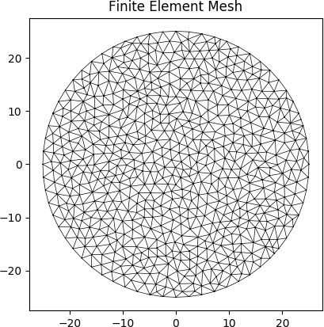
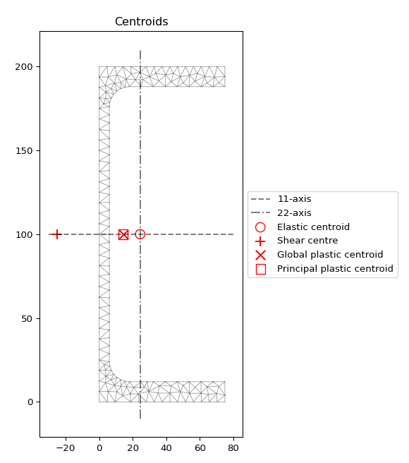

Structure of an Analysis
========================

The process of performing a cross-section analysis with ``sectionproperties`` can
be broken down into three stages:

1. Pre-Processor: The input geometry and finite element mesh is created.
2. Solver: The cross-section properties are determined.
3. Post-Processor: The results are presented in a number of different formats.

Creating a Geometry and Mesh
----------------------------

The dimensions and shape of the cross-section to be analysed define the *geometry*
of the cross-section. The :ref:`Section Library<label-section-library>` provides a number of
functions to easily generate either commonly used structural sections. Alternatively,
arbitrary cross-sections can be built from a list of user-defined points, see
:ref:`label-from-points`.

The final stage in the pre-processor involves generating a finite element mesh of
the *geometry* that the solver can use to calculate the cross-section properties.
This can easily be performed using the :func:`~sectionproperties.pre.geometry.Geometry.create_mesh`
method that all :class:`~sectionproperties.pre.geometry.Geometry` objects have
access to.

The following example creates a geometry object with a circular cross-section.
The diameter of the circle is 50 and 64 points are used to discretise the circumference
of the circle. A finite element mesh is generated with a maximum triangular area
of 2.5::

      import sectionproperties.pre.library.standard_sections as standard_sections

      geometry = standard_sections.circular_section(d=50, n=64)
      geometry.create_mesh(mesh_sizes=[2.5])

    Finite element mesh generated by the above example.

If you are analysing a composite section, or would like to include material properties
in your model, material properties can be created using the :class:`~sectionproperties.pre.pre.Material`
class. The following example creates a steel material object::

      from sectionproperties.pre.pre import Material

      steel = Material(name='Steel', elastic_modulus=200e3, poissons_ratio=0.3, density=7.85e-6,
                       yield_strength=500, color='grey')

Refer to :ref:`label-geom_mesh` for a more detailed explanation of the pre-processing
stage.

Running an Analysis
-------------------

The solver operates on a :class:`~sectionproperties.analysis.cross_section.Section`
object and can perform four different analysis types:

- Geometric Analysis: calculates area properties.
- Plastic Analysis: calculates plastic properties.
- Warping Analysis: calculates torsion and shear properties.
- Stress Analysis: calculates cross-section stresses.

The geometric analysis can be performed individually. However in order to perform
a warping or plastic analysis, a geometric analysis must first be performed. Further,
in order to carry out a stress analysis, both a geometric and warping analysis must
have already been executed. The program will display a helpful error if you try
to run any of these analyses without first performing the prerequisite analyses.

The following example performs a geometric and warping analysis on the circular
cross-section defined in the previous section with steel used as the material
property::

  import sectionproperties.pre.library.standard_sections as standard_sections
  from sectionproperties.analysis.cross_section import Section
  from sectionproperties.pre.pre import Material

  steel = Material(name='Steel', elastic_modulus=200e3, poissons_ratio=0.3, density=7.85e-6,
                   yield_strength=500, color='grey')
  geometry = standard_sections.circular_section(d=50, n=64, material=steel)
  geometry.create_mesh(mesh_sizes=[2.5])  # Adds the mesh to the geometry

  section = Section(geometry)
  section.calculate_geometric_properties()
  section.calculate_warping_properties()

Refer to :ref:`label-analysis` for a more detailed explanation of the solver stage.

Viewing the Results
-------------------

Once an analysis has been performed, a number of methods belonging to the
:class:`~sectionproperties.analysis.cross_section.Section` object can be called
to present the cross-section results in a number of different formats. For example
the cross-section properties can be printed to the terminal, a plot of the centroids
displayed and the cross-section stresses visualised in a contour plot.

The following example analyses a 200 PFC section. The cross-section properties
are printed to the terminal and a plot of the centroids is displayed::

  import sectionproperties.pre.library.steel_sections as steel_sections
  from sectionproperties.analysis.cross_section import Section

  geometry = steel_sections.channel_section(d=200, b=75, t_f=12, t_w=6, r=12, n_r=8)
  geometry.create_mesh(mesh_sizes=[2.5])  # Adds the mesh to the geometry

  section = Section(geometry)
  section.calculate_geometric_properties()
  section.calculate_plastic_properties()
  section.calculate_warping_properties()

  section.plot_centroids()
  section.display_results()

    Plot of the elastic centroid and shear centre for the above example generated
    by :func:`~sectionproperties.analysis.cross_section.Section.plot_centroids`

Output generated by the :func:`~sectionproperties.analysis.cross_section.Section.display_results`
method::

  Section Properties:
  A       = 2.919699e+03
  Perim.  = 6.776201e+02
  Qx      = 2.919699e+05
  Qy      = 7.122414e+04
  cx      = 2.439434e+01
  cy      = 1.000000e+02
  Ixx_g   = 4.831277e+07
  Iyy_g   = 3.392871e+06
  Ixy_g   = 7.122414e+06
  Ixx_c   = 1.911578e+07
  Iyy_c   = 1.655405e+06
  Ixy_c   = -6.519258e-09
  Zxx+    = 1.911578e+05
  Zxx-    = 1.911578e+05
  Zyy+    = 3.271186e+04
  Zyy-    = 6.786020e+04
  rx      = 8.091461e+01
  ry      = 2.381130e+01
  phi     = 0.000000e+00
  I11_c   = 1.911578e+07
  I22_c   = 1.655405e+06
  Z11+    = 1.911578e+05
  Z11-    = 1.911578e+05
  Z22+    = 3.271186e+04
  Z22-    = 6.786020e+04
  r11     = 8.091461e+01
  r22     = 2.381130e+01
  J       = 1.011522e+05
  Iw      = 1.039437e+10
  x_se    = -2.505109e+01
  y_se    = 1.000000e+02
  x_st    = -2.505109e+01
  y_st    = 1.000000e+02
  x1_se   = -4.944543e+01
  y2_se   = 4.905074e-06
  A_sx    = 9.468851e+02
  A_sy    = 1.106943e+03
  A_s11   = 9.468854e+02
  A_s22   = 1.106943e+03
  betax+  = 1.671593e-05
  betax-  = -1.671593e-05
  betay+  = -2.013448e+02
  betay-  = 2.013448e+02
  beta11+ = 1.671593e-05
  beta11- = -1.671593e-05
  beta22+ = -2.013448e+02
  beta22- = 2.013448e+02
  x_pc    = 1.425046e+01
  y_pc    = 1.000000e+02
  Sxx     = 2.210956e+05
  Syy     = 5.895923e+04
  SF_xx+  = 1.156613e+00
  SF_xx-  = 1.156613e+00
  SF_yy+  = 1.802381e+00
  SF_yy-  = 8.688337e-01
  x11_pc  = 1.425046e+01
  y22_pc  = 1.000000e+02
  S11     = 2.210956e+05
  S22     = 5.895923e+04
  SF_11+  = 1.156613e+00
  SF_11-  = 1.156613e+00
  SF_22+  = 1.802381e+00
  SF_22-  = 8.688337e-01

Refer to :ref:`label-post` for a more detailed explanation of the post-processing stage.
