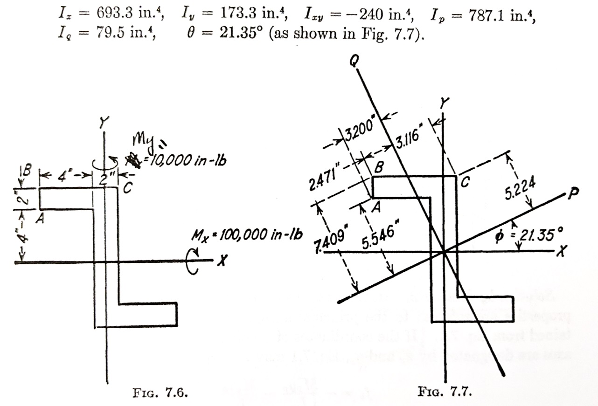
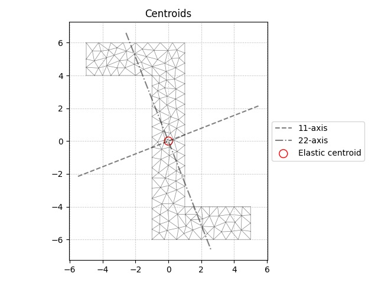

.. highlight:: python
    :linenothreshold: 5

Testing and Results Validation
===============================

sectionproperties has a (slowly) growing suite of tests. The testing suite
serves to verify functionality and find exceptions from edge cases, but 
also validate the results against known cases. Since this library performs 
engineering calculations, it should have some manner of proving its accuracy. 
Obviously each analyst who uses it is responsible for their own projects 
and calculations, but having a high level of confidence that the software 
can produce *correct* results, *given the correct inputs*, is a boon to all users.
Some test results and explanations from the latter category will be outlined 
on this page, since the former really serves no use to the end user.

Text Book Examples
--------------------
An obvious starting location is replicating examples from academic texts.
"Aircraft Structures" by David J. Peery is a highly regarded text in the 
field of aerospace structures [1]_. In the Unsymmetric Beams Chapter (Sec. 7.2), 
Peery outlines the general formulas for beam bending. Example 1 will be 
used here.

In general, this example loads a Z-Section stringer with biaxial bending.::

    class Z_Section:
        '''
        This is basically just a fixture for testing purposes.
        It's called by the actual pytest fixtures to generate
        the Z-sections for analysis.
        '''
        def __init__(self, DIM1, DIM2, DIM3, DIM4, shift, m, name):
            # Setup the analysis, and calculate properties
            self.geom = sections.ZSection(DIM1, DIM2, DIM3, DIM4, shift)
            self.mesh = self.geom.create_mesh([m])
            self.xsect = CrossSection(self.geom, self.mesh)
            self.xsect.calculate_geometric_properties()

        def apply_load(self, v):
            '''
            This method applies the suplied load to the section.

            v is a list-like with the first entry being Mxx, and 
            second entry Myy.
            '''
            self.xsect.calculate_warping_properties()
            self.stress = self.xsect.calculate_stress(Mxx=v[0], Myy=v[1])

    @pytest.fixture
    def PeeryEx7_2_1():
        '''
        Example 1 in Sec. 7.2.
        This is an unsymmetric Z-section with no lateral supports.

        Note that units here are inches, to match the text.
        '''
        return Z_Section(4,2,8,12,shift=[-2,0],m=0.25, name='Peery_7.2.1_geom.png')

Note the dimensions in the last line above, and the shift in the section.

After creating the cross-section, the plot_centroids method can be called to 
verify geometry matches, and we can already verify properties are calculated 
correctly.

Test functions like the one below are included for I_x, I_y, I_xy, 
I_11 (I_P), and I_22 (I_Q)::

    def test_ixx_g(PeeryEx7_2_1):
        # Directly from the example, we know what
        # the section properties should be.
        xsect = PeeryEx7_2_1.xsect
        assert round(xsect.section_props.ixx_g,1) == 693.3

In order to test stress, matching load is applied, and a function to extract 
stress as the specific node must be written [#f1]_::

    def get_node(nodes, coord) -> (int, tuple):
        '''
        This function will loop over the node list provided,
        finding the index of the coordinates you want.

        Returns the index in the nodes list, and the coords.
        '''
        for index,var in enumerate(nodes):
            if all(var == coord):
                return index, var
            else:
                continue

And a stress testing function::

    def test_fb_A(PeeryEx7_2_1):
        '''Check the stress at point A.'''
        # Load from the text
        v = [-1e5, 1e4]
        A = (-5, 4)
        perfect_result = 1210
        text_result = round(-494*-5 + -315*4)
        nodes = PeeryEx7_2_1.xsect.mesh_nodes
        index, _ = get_node(nodes, A)
        stress = PeeryEx7_2_1.apply_load(v)
        computed_result = PeeryEx7_2_1.stress.get_stress()[0]['sig_zz'][index]
        
        assert abs(text_result) == abs(perfect_result)
        assert abs(computed_result) <= 1.005*abs(perfect_result)
        assert abs(computed_result) >= 0.995*abs(perfect_result)

Combined together, this can all be easily executed via pytest:

.. literalinclude:: ../../../sectionproperties/tests/peery.log

100% passing tests validates the section properties and stress results to 
match Peery's theoretical calculations.

.. [1]  D. J. Peery, *Aircraft Structures.* New York: Dover Publications, 2011.
        ISBN-10: 0-486-48580-3

.. [#f1] This function assumes there is a node at your desired coordinates. It does
        *not* find the node closest to your input coords.