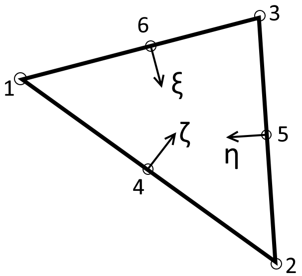

Theoretical Background
======================

Introduction
------------

The analysis of homogenous cross-sections is particularly relevant in structural design, in
particular for the design of steel structures, where complex built-up sections are often utilised.
Accurate warping independent properties, such as the second moment of area and section moduli, are
crucial input for structural analysis and stress verification. Warping dependent properties, such
as the Saint-Venant torsion constant and warping constant are essential in the verification of
slender steel structures when lateral-torsional buckling is critical.

Warping independent properties for basic cross-sections are relatively simple to calculate by hand.
However accurate warping independent properties, even for the most basic cross-section, require
solving several boundary value partial differential equations. This necessitates numerical methods
in the calculation of these properties, which can be extended to arbitrary complex sections.

This section of the documentation describes the theory and application of the finite element method
to cross-sectional analysis used by *sectionproperties*. The goal of *sectionproperties* is to
perform cross-sectional and stress analysis on arbitrary cross-sections, see below figure. In it's
simplest form, an arbitrary cross-section can be defined by a series of points, segments and holes.

.. figure:: ../images/theory/arbitrarySection.png
   :scale: 20 %
   :alt: Arbitrary cross-section
   :align: center

   Arbitrary cross-section with adopted axis convention.

Mesh Generation
---------------

The cross-section is meshed using quadratic superparametric triangular elements (Tri6) using the
`meshpy <https://github.com/inducer/meshpy>`_ library for Python. Superparametric quadratic
elements are defined as having straight edges and mid-nodes located at the mid-point between
adjacent corner nodes. *meshpy* implements
`Triangle <https://www.cs.cmu.edu/~quake/triangle.html>`_, which is a two dimensional quality mesh
generator and Delaunay triangulator written by Jonathan Shewchuk in C.

For the calculation of warping independent properties (i.e. area properties), the mesh
quality is not important as superparametric elements have a constant Jacobian and will result in an
exact solution independent of mesh quality. However, this is not the case for the calculation of
warping dependent properties. As a result, mesh quality and refinement is critical and thus the
user is encouraged to ensure an adequate mesh is generated.

Finite Element Preliminaries
----------------------------

Element Type
^^^^^^^^^^^^

Quadratic six noded triangular elements were implemented in *sectionpropertes* in order to utilise
the finite element formulations for calculating section properties. The figure below shows a
generic six noded triangular element. As previously mentioned, *sectionproperties* implements
superparametric elements, therefore the edges in the below image will always be straight and not
curved.

.. figure:: ../images/theory/six-noded-triangle.png
   :scale: 20 %
   :alt: Six noded triangular element
   :align: center

   Six noded triangular element [1].

The quadratic triangular element was used due to the ease of mesh generation and convergence
advantages over the linear triangular element.

Isoparametric Representation
^^^^^^^^^^^^^^^^^^^^^^^^^^^^

An isoparametric coordinate system has been used to evaluate the shape functions of the parent
element and map them to a generalised triangular element within the mesh. Three independent
isoparametric coordinates (:math:`\eta`, :math:`\xi`, :math:`\zeta`) are used to map the six
noded triangular element as shown in the figure below.

   Isoparametric coordinates for the two dimensional triangular element.

Shape Functions
"""""""""""""""

The shape functions for the six noded triangular element in terms of the isoparametric coordinates
are as follows:

.. math::
  N_1 &= \eta (2 \eta - 1) \\
  N_2 &= \xi (2 \xi - 1) \\
  N_3 &= \zeta (2 \zeta - 1) \\
  N_4 &= 4 \eta \xi \\
  N_5 &= 4 \xi \zeta \\
  N_6 &= 4 \eta \zeta
  :label: eq-shape-functions

The above shape functions can be combined into the shape function row vector:

.. math::
  \textbf{N} = [ N_1 \, N_2 \, N_3 \, N_4 \, N_5 \, N_6 ]

Cartesian Partial Derivatives
"""""""""""""""""""""""""""""

The partial derivatives of the shape functions with respect to the cartesian coordinates, denoted
as the :math:`\textbf{B}` matrix, are required in the finite element formulations of various section
properties. Felippa [1] describes the multiplication of the *Jacobian matrix* (:math:`\textbf{J}`)
and the partial derivative matrix (:math:`\textbf{P}`):

.. math::
  \textbf{J P} =
  \begin{bmatrix}
    1 & 1 & 1 \\
    \sum x_i \frac{\partial N_i}{\partial \eta} & \sum x_i \frac{\partial N_i}{\partial \xi} & \sum x_i \frac{\partial N_i}{\partial \zeta} \\
    \sum y_i \frac{\partial N_i}{\partial \eta} & \sum y_i \frac{\partial N_i}{\partial \xi} & \sum y_i \frac{\partial N_i}{\partial \zeta} \\
  \end{bmatrix}
  \begin{bmatrix}
    \frac{\partial \eta}{\partial x} & \frac{\partial \eta}{\partial y} \\
    \frac{\partial \xi}{\partial x} & \frac{\partial \xi}{\partial y} \\
    \frac{\partial \zeta}{\partial x} & \frac{\partial \zeta}{\partial y} \\
  \end{bmatrix} =
  \begin{bmatrix}
    0 & 0 \\
    1 & 0 \\
    0 & 1 \\
  \end{bmatrix}
  :label: eq-JP

The determinant of the *Jacobian matrix* scaled by one half is equal to the Jacobian:

.. math::
  J = \frac{1}{2} \textrm{det} \, \textbf{J}

Equation :eq:`eq-JP` can be re-arranged to evaluate the partial derivate matrix
(:math:`\textbf{P}`):

.. math::
  \textbf{P} = \textbf{J}^{-1}
  \begin{bmatrix}
  0 & 0 \\
  1 & 0 \\
  0 & 1 \\
  \end{bmatrix}

As described in [1], the derivates of the shape functions can be evaluated using the below
expressions:

.. math::
  \textbf{B}^{\rm T}  =
  \begin{bmatrix}
    \frac{\partial N_i}{\partial x} & \frac{\partial N_i}{\partial y}
  \end{bmatrix} =
  \begin{bmatrix}
    \frac{\partial N_i}{\partial \eta} & \frac{\partial N_i}{\partial \xi} & \frac{\partial N_i}{\partial \zeta} \\
  \end{bmatrix}
  \begin{bmatrix}
    \textbf{P}
  \end{bmatrix}

where the derivatives of the shape functions with respect to the isoparametric parameters can
easily be evaluated from Equation :eq:`eq-shape-functions`, resulting in the following expression
for the :math:`\textbf{B}` matrix:

.. math::
  \textbf{B}^{\rm T}  =
  \begin{bmatrix}
    4 \eta - 1 & 0 & 0 \\
    0 & 4 \xi - 1 & 0 \\
    0 & 0 & 4 \zeta - 1 \\
    4 \xi & 4 \eta & 0 \\
    0 & 4 \zeta & 4 \xi \\
    4 \zeta & 0 & 4 \eta \\
  \end{bmatrix} \textbf{J}^{-1}
  \begin{bmatrix}
    0 & 0 \\
    1 & 0 \\
    0 & 1 \\
  \end{bmatrix}

Numerical Integration
^^^^^^^^^^^^^^^^^^^^^

Three different integration schemes are utilised in the cross-section analysis in order to evaluate
the integrals of varying order polynomials. The one point, three point and six point integration
schemes are summarised in the figure below:

.. list-table:: Six noded triangle integration schemes with maximum degree of polynomial that is evaluated exactly [1].

   * - .. figure:: ../images/theory/int1.png
          :scale: 15 %
          :alt: 1 pt. integration; p-degree = 1.
          :align: center

          1 pt. integration; p-degree = 1.

     - .. figure:: ../images/theory/int2.png
          :scale: 15 %
          :alt: 3 pt. integration; p-degree = 2.
          :align: center

          3 pt. integration; p-degree = 2.

     - .. figure:: ../images/theory/int3.png
          :scale: 15 %
          :alt: 6 pt. integration; p-degree = 4.
          :align: center

          6 pt. integration; p-degree = 4.

The locations and weights of the Gauss points are summarised in the table below [1]:

+--------+-----------------------+----------------------+------------------------+---------------------+
| Scheme | :math:`\eta`-location | :math:`\xi`-location | :math:`\zeta`-location | weight              |
+========+=======================+======================+========================+=====================+
| 1 pt.  | :math:`\frac{1}{3}`   | :math:`\frac{1}{3}`  | :math:`\frac{1}{3}`    | 1                   |
+--------+-----------------------+----------------------+------------------------+---------------------+
|        | :math:`\frac{2}{3}`   | :math:`\frac{1}{6}`  | :math:`\frac{1}{6}`    | :math:`\frac{1}{3}` |
|        +-----------------------+----------------------+------------------------+---------------------+
| 3 pt.  | :math:`\frac{1}{6}`   | :math:`\frac{2}{3}`  | :math:`\frac{1}{6}`    | :math:`\frac{1}{3}` |
|        +-----------------------+----------------------+------------------------+---------------------+
|        | :math:`\frac{1}{6}`   | :math:`\frac{1}{6}`  | :math:`\frac{2}{3}`    | :math:`\frac{1}{3}` |
+--------+-----------------------+----------------------+------------------------+---------------------+
|        | :math:`1 - 2 g_2`     | :math:`g_2`          | :math:`g_2`            | :math:`w_2`         |
|        +-----------------------+----------------------+------------------------+---------------------+
|        | :math:`g_2`           | :math:`1 - 2 g_2`    | :math:`g_2`            | :math:`w_2`         |
|        +-----------------------+----------------------+------------------------+---------------------+
|        | :math:`g_2`           | :math:`g_2`          | :math:`1 - 2 g_2`      | :math:`w_2`         |
| 6 pt.  +-----------------------+----------------------+------------------------+---------------------+
|        | :math:`g_1`           | :math:`g_1`          | :math:`1 - 2 g_1`      | :math:`w_1`         |
|        +-----------------------+----------------------+------------------------+---------------------+
|        | :math:`1 - 2 g_1`     | :math:`g_1`          | :math:`g_1`            | :math:`w_1`         |
|        +-----------------------+----------------------+------------------------+---------------------+
|        | :math:`g_1`           | :math:`1 - 2 g_1`    | :math:`g_1`            | :math:`w_1`         |
+--------+-----------------------+----------------------+------------------------+---------------------+

The parameters for the six point numerical integration are shown below:

.. math::
  g_{1,2} &= \frac{1}{18} \left(8 - \sqrt{10} \pm \sqrt{38 - 44\sqrt{\frac{2}{5}}}\right) \\
  w_{1,2} &= \frac{620 \pm \sqrt{213125-53320 \sqrt{10}}}{3720}

Bringing together the isoparametric representation of the six noded triangular element and
numerical integration, the integration of a function :math:`f(\eta, \xi, \zeta)` proves to be
simpler than integrating the corresponding function :math:`f(x,y)` over the cartesian element [2].
The transformation formula for integrals is:

.. math::
  \int_{\Omega} f(x,y) \, dx \, dy &= \int_{\Omega_r} f(\eta, \xi, \zeta) \, J \, d\eta \, d\xi \, d\zeta \\
  &= \sum_i^n w_i f(\eta_i, \xi_i, \zeta_i) \, J_i

where the sum is taken over the integration points, :math:`w_i` is the weight of the current
integration point and :math:`J_i` is the Jacobian at the current integration point (recall that the
Jacobian is constant for the superparametric six noded triangular element).

Extrapolation to Nodes
^^^^^^^^^^^^^^^^^^^^^^

The most optimal location to sample stresses are at the integration points, however the results are
generally plotted using nodal values. As a result, the stresses at the integration points need to
be extrapolated to the nodes of the element. The extrapolated stresses at the nodes
(:math:`\tilde{\boldsymbol{\sigma}}_g`) can be calculated through the multiplication of a smoothing
matrix (:math:`\textbf{H}`) and the stresses at the integration points
(:math:`\boldsymbol{\sigma}_g`) [2]:

.. math::
  \tilde{\boldsymbol{\sigma}}_g = \textbf{H}^{-1} \, \boldsymbol{\sigma}_g

where the :math:`\textbf{H}` matrix contains the row vectors of the shape functions at each
integration point:

.. math::
  \textbf{H} =
  \begin{bmatrix}
    \textbf{N}(\eta_1, \xi_1, \zeta_1) \\
    \textbf{N}(\eta_2, \xi_2, \zeta_2) \\
    \textbf{N}(\eta_3, \xi_3, \zeta_3) \\
    \textbf{N}(\eta_4, \xi_4, \zeta_4) \\
    \textbf{N}(\eta_5, \xi_5, \zeta_5) \\
    \textbf{N}(\eta_6, \xi_6, \zeta_6) \\
  \end{bmatrix}

Where two or more elements share the same node, nodal averaging is used to evaluate the nodal stress.

Lagrangian Multiplier
^^^^^^^^^^^^^^^^^^^^^

As described in the calculation of the :ref:`label-theory-torsion` and :ref:`label-theory-shear`, partial differential
equations are to be solved with purely Neumann boundary conditions. In the context of the torsion
and shear problem, this involves the inversion of a nearly singular global stiffness matrix. After
shifting the domain such that the centroid coincides with the global origin, the Lagrangian
multiplier method is used to solve the set of linear equations of the form
:math:`\textbf{K} \textbf{u} = \textbf{F}` by introducing an extra constraint on the solution
vector whereby the mean value is equal to zero. Larson et. al [3] describe the resulting modified
stiffness matrix, and solution and load vector:

.. math::
  \begin{bmatrix}
    \textbf{K} & \textbf{C}^{\rm{T}} \\
    \textbf{C} & 0 \\
  \end{bmatrix}
  \begin{bmatrix}
    \textbf{u} \\
    \lambda \\
  \end{bmatrix} =
  \begin{bmatrix}
    \textbf{F} \\
    0 \\
  \end{bmatrix}

where :math:`\textbf{C}` is a row vector of ones and :math:`\lambda` may be though of as a force
acting to enforce the constraints, which should be relatively small when compared to the values in
the force vector and can be omitted from the solution vector.

Calculation of Cross-Section Properties
---------------------------------------

Cross-Sectional Area
^^^^^^^^^^^^^^^^^^^^

area

First Moments of Area
^^^^^^^^^^^^^^^^^^^^^

area

Centroids
^^^^^^^^^

centroid

Second Moments of Area
^^^^^^^^^^^^^^^^^^^^^^

area

Radii of Gyration
^^^^^^^^^^^^^^^^^

radii

Elastic Section Moduli
^^^^^^^^^^^^^^^^^^^^^^

moduli

Plastic Section Moduli
^^^^^^^^^^^^^^^^^^^^^^

moduli

Principal Axis Properties
^^^^^^^^^^^^^^^^^^^^^^^^^

prinicpal

.. _label-theory-torsion:

Torsion Constant
^^^^^^^^^^^^^^^^

torsion

.. _label-theory-shear:

Shear Properties
^^^^^^^^^^^^^^^^

shear

Shear Centre
""""""""""""

shear

Shear Deformation Coefficients
""""""""""""""""""""""""""""""

shear

Warping Constant
""""""""""""""""

warp

Cross-Section Stresses
----------------------

stresses

Axial Stresses
^^^^^^^^^^^^^^

axial

Bending Stresses
^^^^^^^^^^^^^^^^

Global Axis Bending
"""""""""""""""""""

bend

Principal Axis Bending
""""""""""""""""""""""

bend

Torsion Stresses
^^^^^^^^^^^^^^^^

twist

Shear Stresses
^^^^^^^^^^^^^^

shear

Principal Stresses
^^^^^^^^^^^^^^^^^^

principal

von Mises Stresses
^^^^^^^^^^^^^^^^^^

vm

Mohr's Circle
^^^^^^^^^^^^^

mohr

.. _label-theory-composite:

Composite Cross-Sections
------------------------

composite

..  Mention that Poisson's ratios should be relatively close as if the Poisson's
    ratio is largely variable, the basic contention that sig_x = sig_y = sig_xy = 0
    ceases to be applicable.

..  In this program an effective Poisson's ratio is calculated by determining a
    weighted E and G and then deriving a nu that is effective for the entire
    cross-section.

References
----------

1. C. A. Felippa, Introduction to Finite Element Methods, Department of Aerospace Engineering Sciences and Center for Aerospace Structures University of Colorado, Boulder, Colorado, 2004.

2. W. D. Pilkey, Analysis and Design of Elastic Beams: Computational Methods, John Wiley & Sons, Inc., New York, 2002.

3. M. G. Larson, F. Bengzon, The Finite Element Method: Theory, Implementation, and Applications, Vol. 10, Springer, Berlin, Heidelberg, 2013. doi:10.1007/978-3-642-33287-6.
