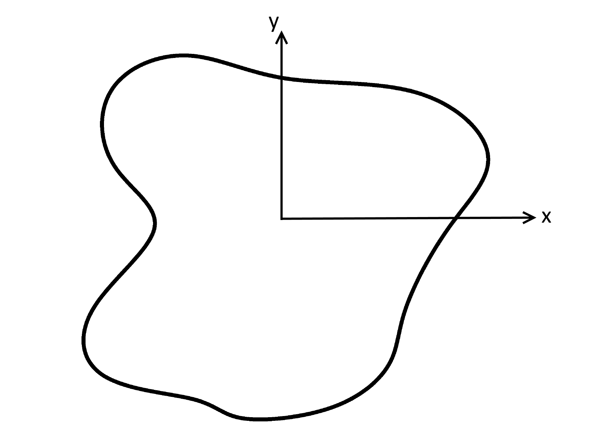
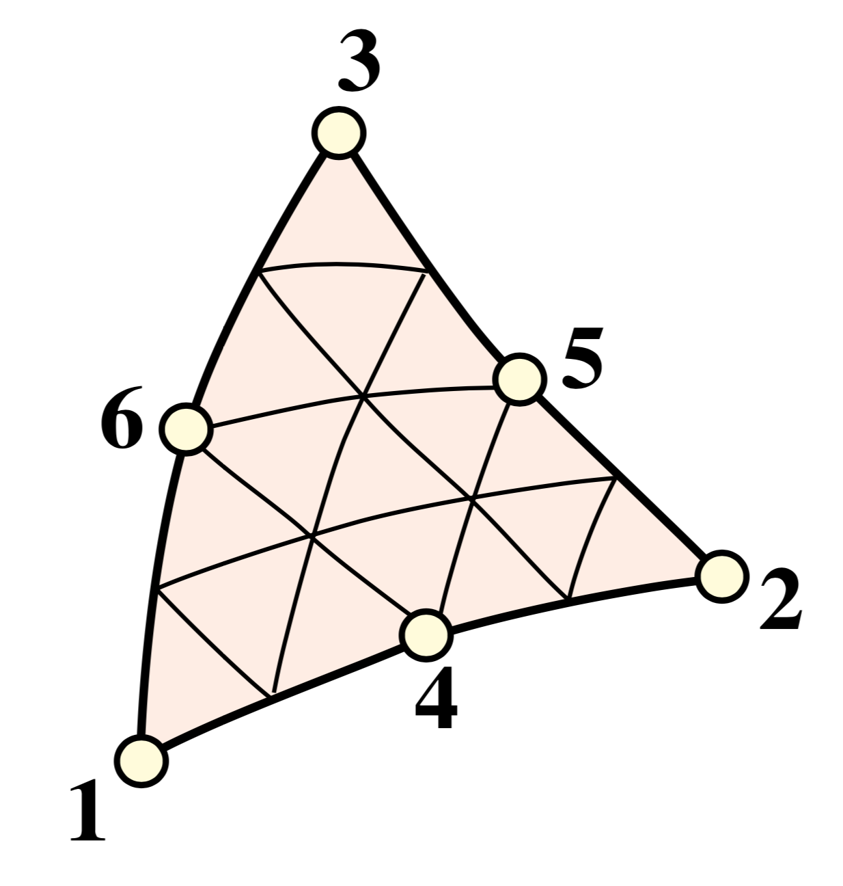

Theory
======

Introduction
------------

The analysis of homogenous cross-sections is particularly relevant in structural design,
in particular for the design of steel structures, where complex built-up sections are
often utilised. Accurate warping independent properties, such as the second moment of
area and section moduli, are crucial input for structural analysis and stress
verification. Warping dependent properties, such as the Saint-Venant torsion constant
and warping constant are essential in the verification of slender steel structures when
lateral-torsional buckling is critical.

Warping independent properties for basic cross-sections are relatively simple to
calculate by hand. However accurate warping independent properties, even for the most
basic cross-section, require solving several boundary value partial differential
equations. This necessitates numerical methods in the calculation of these properties,
which can be extended to arbitrary complex sections.

This section of the documentation describes the theory and application of the finite
element method to cross-sectional analysis used by ``sectionproperties``. The goal of
``sectionproperties`` is to perform cross-sectional and stress analysis on arbitrary
cross-sections, see below figure. In its simplest form, an arbitrary cross-section can
be defined by a series of points, segments and holes.

  Arbitrary cross-section with adopted axis convention.

Mesh Generation
---------------

The cross-section is meshed using quadratic superparametric triangular elements
(``Tri6``) using the `CyTriangle library <https://github.com/m-clare/cytriangle>`__ for
Python. Superparametric quadratic elements are defined as having straight edges and
mid-nodes located at the mid-point between adjacent corner nodes. ``CyTriangle``
implements `Triangle <https://www.cs.cmu.edu/~quake/triangle.html>`__, which is a two
dimensional quality mesh generator and Delaunay triangulator written by Jonathan
Shewchuk in C.

For the calculation of warping independent properties (i.e. area properties), the mesh
quality is not important as superparametric elements have a constant Jacobian and will
result in an exact solution independent of mesh quality. However, this is not the case
for the calculation of warping dependent properties. As a result, mesh quality and
refinement is critical and thus the user is encouraged to ensure an adequate mesh is
generated.

Finite Element Preliminaries
----------------------------

Element Type
~~~~~~~~~~~~

Quadratic six noded triangular elements were implemented in ``sectionproperties`` in
order to utilise the finite element formulations for calculating section properties. The
figure below shows a generic six noded triangular element. As previously mentioned,
``sectionproperties`` implements superparametric elements, therefore the edges in the
below image will always be straight and not curved.

  Six noded triangular element [Felippa]_

The quadratic triangular element was used due to the ease of mesh generation and
convergence advantages over the linear triangular element.

Isoparametric Representation
~~~~~~~~~~~~~~~~~~~~~~~~~~~~

An isoparametric coordinate system has been used to evaluate the shape functions of the
parent element and map them to a generalised triangular element within the mesh. Three
independent isoparametric coordinates (:math:`\eta`, :math:`\xi`, :math:`\zeta`) are
used to map the six noded triangular element as shown in the figure below.

.. figure:: ../_static/theory/isoparametric.png
  :width: 40 %
  :alt: Isoparametric coordinates for the two dimensional triangular element.
  :align: center

  Isoparametric coordinates for the two dimensional triangular element.

Shape Functions
^^^^^^^^^^^^^^^

The shape functions for the six noded triangular element in terms of the isoparametric
coordinates are as follows:

.. math::
  N_1 &= \eta (2 \eta - 1) \\
  N_2 &= \xi (2 \xi - 1) \\
  N_3 &= \zeta (2 \zeta - 1) \\
  N_4 &= 4 \eta \xi \\
  N_5 &= 4 \xi \zeta \\
  N_6 &= 4 \eta \zeta

The above shape functions can be combined into the shape function row vector:

.. math::
  \textbf{N} = [ N_1 \, N_2 \, N_3 \, N_4 \, N_5 \, N_6 ]

Cartesian Partial Derivatives
^^^^^^^^^^^^^^^^^^^^^^^^^^^^^

The partial derivatives of the shape functions with respect to the cartesian
coordinates, denoted as the :math:`\textbf{B}` matrix, are required in the finite
element formulations of various section properties. [Felippa]_ describes
the multiplication of the *Jacobian matrix* (:math:`\textbf{J}`) and the partial
derivative matrix (:math:`\textbf{P}`):

.. math::
  \textbf{J P} =
  \begin{bmatrix}
    1 & 1 & 1 \\
    \sum x_i \frac{\partial N_i}{\partial \eta} & \sum x_i \frac{\partial N_i}{\partial \xi} & \sum x_i \frac{\partial N_i}{\partial \zeta} \\
    \sum y_i \frac{\partial N_i}{\partial \eta} & \sum y_i \frac{\partial N_i}{\partial \xi} & \sum y_i \frac{\partial N_i}{\partial \zeta} \\
  \end{bmatrix}
  \begin{bmatrix}
    \frac{\partial \eta}{\partial x} & \frac{\partial \eta}{\partial y} \\
    \frac{\partial \xi}{\partial x} & \frac{\partial \xi}{\partial y} \\
    \frac{\partial \zeta}{\partial x} & \frac{\partial \zeta}{\partial y} \\
  \end{bmatrix} =
  \begin{bmatrix}
    0 & 0 \\
    1 & 0 \\
    0 & 1 \\
  \end{bmatrix}

The determinant of the *Jacobian matrix* scaled by one half is equal to the Jacobian:

.. math::
  J = \frac{1}{2} \textrm{det} \, \textbf{J}

The equation for :math:`\textbf{J P}` can be re-arranged to evaluate the partial
derivate matrix (:math:`\textbf{P}`):

.. math::
  \textbf{P} = \textbf{J}^{-1}
  \begin{bmatrix}
  0 & 0 \\
  1 & 0 \\
  0 & 1 \\
  \end{bmatrix}

As described in [Felippa]_, the derivates of the shape functions can be evaluated
using the below expressions:

.. math::
  \textbf{B}^{\rm T}  =
  \begin{bmatrix}
    \frac{\partial N_i}{\partial x} & \frac{\partial N_i}{\partial y}
  \end{bmatrix} =
  \begin{bmatrix}
    \frac{\partial N_i}{\partial \eta} & \frac{\partial N_i}{\partial \xi} & \frac{\partial N_i}{\partial \zeta} \\
  \end{bmatrix}
  \begin{bmatrix}
    \textbf{P}
  \end{bmatrix}

where the derivatives of the shape functions with respect to the isoparametric
parameters can easily be evaluated from the equation for the shape functions, resulting
in the following expression for the :math:`\textbf{B}` matrix:

.. math::
  \textbf{B}^{\rm T}  =
  \begin{bmatrix}
    4 \eta - 1 & 0 & 0 \\
    0 & 4 \xi - 1 & 0 \\
    0 & 0 & 4 \zeta - 1 \\
    4 \xi & 4 \eta & 0 \\
    0 & 4 \zeta & 4 \xi \\
    4 \zeta & 0 & 4 \eta \\
  \end{bmatrix} \textbf{J}^{-1}
  \begin{bmatrix}
    0 & 0 \\
    1 & 0 \\
    0 & 1 \\
  \end{bmatrix}

Numerical Integration
~~~~~~~~~~~~~~~~~~~~~

Three different integration schemes are utilised in the cross-section analysis in order
to evaluate the integrals of varying order polynomials. The one point, three point and
six point integration schemes are summarised in the figure below [Felippa]_:

.. list-table:: Six noded triangle integration schemes with maximum degree of polynomial
    that is evaluated exactly.

   * - .. figure:: ../_static/theory/int1.png
          :width: 100 %
          :alt: 1pt integration; p-degree=1
          :align: center

          1pt integration; p-degree=1

     - .. figure:: ../_static/theory/int2.png
          :width: 100 %
          :alt: 3pt integration; p-degree=2
          :align: center

          3pt integration; p-degree=2

     - .. figure:: ../_static/theory/int3.png
          :width: 100 %
          :alt: 6pt integration; p-degree=4
          :align: center

          6pt integration; p-degree=4

The locations and weights of the Gauss points are summarised in the table below
[Felippa]_:

+--------+-----------------------+----------------------+------------------------+---------------------+
| Scheme | :math:`\eta`-location | :math:`\xi`-location | :math:`\zeta`-location | weight              |
+========+=======================+======================+========================+=====================+
| 1 pt.  | :math:`\frac{1}{3}`   | :math:`\frac{1}{3}`  | :math:`\frac{1}{3}`    | 1                   |
+--------+-----------------------+----------------------+------------------------+---------------------+
|        | :math:`\frac{2}{3}`   | :math:`\frac{1}{6}`  | :math:`\frac{1}{6}`    | :math:`\frac{1}{3}` |
|        +-----------------------+----------------------+------------------------+---------------------+
| 3 pt.  | :math:`\frac{1}{6}`   | :math:`\frac{2}{3}`  | :math:`\frac{1}{6}`    | :math:`\frac{1}{3}` |
|        +-----------------------+----------------------+------------------------+---------------------+
|        | :math:`\frac{1}{6}`   | :math:`\frac{1}{6}`  | :math:`\frac{2}{3}`    | :math:`\frac{1}{3}` |
+--------+-----------------------+----------------------+------------------------+---------------------+
|        | :math:`1 - 2 g_2`     | :math:`g_2`          | :math:`g_2`            | :math:`w_2`         |
|        +-----------------------+----------------------+------------------------+---------------------+
|        | :math:`g_2`           | :math:`1 - 2 g_2`    | :math:`g_2`            | :math:`w_2`         |
|        +-----------------------+----------------------+------------------------+---------------------+
|        | :math:`g_2`           | :math:`g_2`          | :math:`1 - 2 g_2`      | :math:`w_2`         |
| 6 pt.  +-----------------------+----------------------+------------------------+---------------------+
|        | :math:`g_1`           | :math:`g_1`          | :math:`1 - 2 g_1`      | :math:`w_1`         |
|        +-----------------------+----------------------+------------------------+---------------------+
|        | :math:`1 - 2 g_1`     | :math:`g_1`          | :math:`g_1`            | :math:`w_1`         |
|        +-----------------------+----------------------+------------------------+---------------------+
|        | :math:`g_1`           | :math:`1 - 2 g_1`    | :math:`g_1`            | :math:`w_1`         |
+--------+-----------------------+----------------------+------------------------+---------------------+

The parameters for the six point numerical integration are shown below:

.. math::
  g_{1,2} &= \frac{1}{18} \left(8 - \sqrt{10} \pm \sqrt{38 - 44\sqrt{\frac{2}{5}}}\right) \\
  w_{1,2} &= \frac{620 \pm \sqrt{213125-53320 \sqrt{10}}}{3720}

Bringing together the isoparametric representation of the six noded triangular element
and numerical integration, the integration of a function :math:`f(\eta, \xi, \zeta)`
proves to be simpler than integrating the corresponding function :math:`f(x,y)` over the
cartesian element [Pilkey]_. The transformation formula for integrals is:

.. math::
  \int_{\Omega} f(x,y) \, dx \, dy &= \int_{\Omega_r} f(\eta, \xi, \zeta) \, J \, d\eta \, d\xi \, d\zeta \\
  &= \sum_i^n w_i f(\eta_i, \xi_i, \zeta_i) \, J_i

where the sum is taken over the integration points, :math:`w_i` is the weight of the
current integration point and :math:`J_i` is the Jacobian at the current integration
point (recall that the Jacobian is constant for the superparametric six noded triangular
element).

.. _label-extrapolation:

Extrapolation to Nodes
~~~~~~~~~~~~~~~~~~~~~~

The most optimal location to sample stresses are at the integration points, however the
results are generally plotted using nodal values. As a result, the stresses at the
integration points need to be extrapolated to the nodes of the element. The extrapolated
stresses at the nodes (:math:`\tilde{\boldsymbol{\sigma}}_g`) can be calculated through
the multiplication of a smoothing matrix (:math:`\textbf{H}`) and the stresses at the
integration points (:math:`\boldsymbol{\sigma}_g`) [Pilkey]_:

.. math::
  \tilde{\boldsymbol{\sigma}}_g = \textbf{H}^{-1} \, \boldsymbol{\sigma}_g

where the :math:`\textbf{H}` matrix contains the row vectors of the shape functions at
each integration point:

.. math::
  \textbf{H} =
  \begin{bmatrix}
    \textbf{N}(\eta_1, \xi_1, \zeta_1) \\
    \textbf{N}(\eta_2, \xi_2, \zeta_2) \\
    \textbf{N}(\eta_3, \xi_3, \zeta_3) \\
    \textbf{N}(\eta_4, \xi_4, \zeta_4) \\
    \textbf{N}(\eta_5, \xi_5, \zeta_5) \\
    \textbf{N}(\eta_6, \xi_6, \zeta_6) \\
  \end{bmatrix}

Where two or more elements share the same node, nodal averaging is used to evaluate the
nodal stress.

Lagrangian Multiplier
~~~~~~~~~~~~~~~~~~~~~

As described in the calculation of the :ref:`label-theory-torsion` and
:ref:`label-theory-shear`, partial differential equations are to be solved
with purely Neumann boundary conditions. In the context of the torsion and shear
problem, this involves the inversion of a nearly singular global stiffness matrix. After
shifting the domain such that the centroid coincides with the global origin, the
Lagrangian multiplier method is used to solve the set of linear equations of the form
:math:`\textbf{K} \textbf{u} = \textbf{F}` by introducing an extra constraint on the
solution vector whereby the mean value is equal to zero. [Larson]_ et al.
describe the resulting modified stiffness matrix, and solution and load vector:

.. math::
  \begin{bmatrix}
    \textbf{K} & \textbf{C}^{\rm{T}} \\
    \textbf{C} & 0 \\
  \end{bmatrix}
  \begin{bmatrix}
    \textbf{u} \\
    \lambda \\
  \end{bmatrix} =
  \begin{bmatrix}
    \textbf{F} \\
    0 \\
  \end{bmatrix}

where :math:`\textbf{C}` is the assembly of :math:`\int_{\Omega} \textbf{N} \, d \Omega`
and :math:`\lambda` may be thought of as a force acting to enforce the constraints, which
should be relatively small when compared to the values in the force vector and can be
omitted from the solution vector.

Calculation of Cross-Section Properties
---------------------------------------

Cross-Sectional Area
~~~~~~~~~~~~~~~~~~~~

The area ``A`` of the cross-section is given by [Pilkey]_:

.. math::
  A = \int_A dx \, dy = \sum_e A_e = \sum_e \int_{\Omega} J_e \, d\eta \, d\xi \, d\zeta

As the Jacobian is constant over the element, the integration over the element domain in
the above equation can be performed using one point integration:

.. math::
  A = \sum_e \sum_{i=1}^1 w_i J_i

First Moments of Area
~~~~~~~~~~~~~~~~~~~~~

The first moments of area are defined by [Pilkey]_:

.. math::
  Q_x &= \int_A y \, dA = \sum_e \int_{\Omega} \textbf{N} \textbf{y}_e J_e \, d\eta \, d\xi \, d\zeta \\
  Q_y &= \int_A x \, dA = \sum_e \int_{\Omega} \textbf{N} \textbf{x}_e J_e \, d\eta \, d\xi \, d\zeta \\

where :math:`\textbf{x}_e` and :math:`\textbf{y}_e` are column vectors containing the
cartesian coordinates of the element nodes. The above equations can be evaluated using
three point integration as the shape functions (:math:`\textbf{N}`) are quadratic:

.. math::
  Q_x &= \sum_e \sum_{i=1}^3 w_i \textbf{N}_i \textbf{y}_e J_e \\
  Q_y &= \sum_e \sum_{i=1}^3 w_i \textbf{N}_i \textbf{x}_e J_e \\

Centroids
~~~~~~~~~

The coordinates of the centroid are found from [Pilkey]_:

.. math::
  x_c &= \frac{Q_y}{A} \\
  y_c &= \frac{Q_x}{A} \\

Second Moments of Area
~~~~~~~~~~~~~~~~~~~~~~

The second moments of area are defined by [Pilkey]_:

.. math::
  I_{xx} &= \int_A y^2 \, dA = \sum_e \int_{\Omega} (\textbf{N} \textbf{y}_e)^2 J_e \, d\eta \, d\xi \, d\zeta \\
  I_{yy} &= \int_A x^2 \, dA = \sum_e \int_{\Omega} (\textbf{N} \textbf{x}_e)^2 J_e \, d\eta \, d\xi \, d\zeta \\
  I_{xy} &= \int_A xy \, dA = \sum_e \int_{\Omega} \textbf{N} \textbf{y}_e \textbf{N} \textbf{x}_e  J_e \, d\eta \, d\xi \, d\zeta \\

The above equations can be evaluated using six point integration as the square of the
shape functions are quartic:

.. math::
  I_{xx} &= \sum_e \sum_{i=1}^6 w_i (\textbf{N}_i \textbf{y}_e)^2 J_e \\
  I_{yy} &= \sum_e \sum_{i=1}^6 w_i (\textbf{N}_i \textbf{x}_e)^2 J_e \\
  I_{xy} &= \sum_e \sum_{i=1}^6 w_i \textbf{N} \textbf{y}_e \textbf{N} \textbf{x}_e J_e \\

The above equations list the second moments of area about the global coordinate system
axis, which is chosen arbitrarily by the user. These properties can be found about the
centroidal axis of the cross-section by using the parallel axis theorem:

.. math::
  I_{\overline{xx}} &= I_{xx} - {y_c}^2 A = I_{xx} - \frac{{Q_x}^2}{A} \\
  I_{\overline{yy}} &= I_{yy} - {x_c}^2 A = I_{yy} - \frac{{Q_y}^2}{A} \\
  I_{\overline{xy}} &= I_{xy} - x_c y_c A = I_{xy} - \frac{Q_x Q_y}{A} \\

Radii of Gyration
~~~~~~~~~~~~~~~~~

The radii of gyration can be calculated from the second moments of area and the
cross-sectional area as follows [Pilkey]_:

.. math::
  r_x = \sqrt{\frac{I_{xx}}{A}} \\
  r_y = \sqrt{\frac{I_{yy}}{A}} \\

.. _label-theory-elastic-section-moduli:

Elastic Section Moduli
~~~~~~~~~~~~~~~~~~~~~~

The elastic section modulii can be calculated from the second moments of area and the
extreme (min. and max.) coordinates of the cross-section in the x and y-directions
[Pilkey]_:

.. math::
  Z_{xx}^+ = \frac{I_{\overline{xx}}}{y_{max} - y_c} \\
  Z_{xx}^- = \frac{I_{\overline{xx}}}{y_c - y_{min}} \\
  Z_{yy}^+ = \frac{I_{\overline{yy}}}{x_{max} - x_c} \\
  Z_{yy}^- = \frac{I_{\overline{yy}}}{x_c - x_{min}} \\

.. _label-theory-plastic-section-moduli:

Plastic Section Moduli
~~~~~~~~~~~~~~~~~~~~~~

For a homogenous section, the plastic centroid can be determined by finding the
intersection of the two lines that evenly divide the cross-sectional area in both the
:math:`x` and :math:`y` directions. A suitable procedure could not be found in
literature and thus an algorithm involving the iterative incrementation of the plastic
centroid was developed. The algorithm uses
`Brent's method <https://docs.scipy.org/doc/scipy/reference/generated/scipy.optimize.brentq.html>`__
to efficiently locate the plastic centroidal axes in the global and principal
directions.

Once the plastic centroid has been located, the plastic section moduli can be readily
computed using the following expression:

.. math::
  S_{xx} &= \frac{A}{2} \left| y_{c,t} - y_{c,b} \right| \\
  S_{yy} &= \frac{A}{2} \left| x_{c,t} - x_{c,b} \right|

where :math:`A` is the cross-sectional area, and :math:`x_{c,t}` and :math:`x_{c,b}`
refer to the centroids of the top half section and bottom half section respectively.

Principal Axis Properties
~~~~~~~~~~~~~~~~~~~~~~~~~

The principal bending axes are determined by calculating the principal moments of
inertia [Pilkey]_:

.. math::
  I_{11} &= \frac{I_{\overline{xx}} + I_{\overline{yy}}}{2} + \Delta \\
  I_{22} &= \frac{I_{\overline{xx}} + I_{\overline{yy}}}{2} - \Delta \\

where:

.. math::
  \Delta = \sqrt{\left(\frac{I_{\overline{xx}} - I_{\overline{yy}}}{2}\right)^2 + {I_{\overline{xy}}}^2}

The angle between the :math:`\bar{x}` axis and the axis belonging to the largest
principal moment of inertia can be computed as follows:

.. math::
  \phi = {\tan}^{-1} \frac{I_{\overline{xx}} - I_{11}}{I_{\overline{xy}}}

The prinicpal section moduli require the calculation of the perpendicular distance from
the principal axes to the extreme fibres. All the nodes in the mesh are considered with
vector algebra used to compute the perpendicular distances and the minimum and maximum
distances identified. The perpendicular distance from a point :math:`P` to a line
parallel to :math:`\overrightarrow{u}` that passes through :math:`Q` is given by:

.. math::
  d = | \, \overrightarrow{PQ} \times \overrightarrow{u} \, |

The location of the point is checked to see whether it is above or below the principal
axis. Again vector algebra is used to check this condition. The condition in the below
equation will result in the point being above the :math:`\overrightarrow{u}` axis.

.. math::
  \overrightarrow{QP} \times \overrightarrow{u} < 0

Using the above equations, the principal section moduli can be computed similar to that
in the calculation of the :ref:`label-theory-elastic-section-moduli` and
:ref:`label-theory-plastic-section-moduli`.

.. _label-theory-torsion:

Torsion Constant
~~~~~~~~~~~~~~~~

The Saint-Venant torsion constant (:math:`J`) can be obtained by solving the below
partial differential equation for the warping function, :math:`\omega`:

.. math::
  \nabla^2 \omega = 0

subject to the boundary condition described below:

.. math::
  \frac{\partial \omega}{\partial x} n_x + \frac{\partial \omega}{\partial y} n_y = y n_x - x n_y

[Pilkey]_ shows that by using the finite element method, this problem can be
reduced to a set of linear equations of the form:

.. math::
  \textbf{K} \boldsymbol{\omega} = \textbf{F}

where :math:`\textbf{K}` and :math:`\textbf{F}` are assembled through summation at
element level. The element equations for the :math:`e^{\textrm{th}}` element are:

.. math::
  \textbf{k}^e \boldsymbol{\omega}^e = \textbf{f}^e

with the stiffness matrix defined as:

.. math::
  \textbf{k}^e = \int_{\Omega} \textbf{B}^{\rm T} \textbf{B} J_e \, d\eta \, d\xi \, d\zeta

and the load vector defined as:

.. math::
  \textbf{f}^e = \int_{\Omega} \textbf{B}^{\rm T}
  \begin{bmatrix}
    \textbf{N} \textbf{y} \\
    -\textbf{N} \textbf{x} \\
  \end{bmatrix}
  J_e \, d\eta \, d\xi \, d\zeta

Applying numerical integration to the stiffness matrix and load vector results in the
following expressions:

.. math::
  \textbf{k}^e &= \sum_{i=1}^6 w_i \textbf{B}_i^{\rm T} \textbf{B}_i J_e \\
  \textbf{f}^e &= \sum_{i=1}^6 w_i \textbf{B}_i^{\rm T}
  \begin{bmatrix}
    \textbf{N}_i \textbf{y}_e \\
    -\textbf{N}_i \textbf{x}_e \\
  \end{bmatrix} J_e

Once the warping function has been evaluated, the Saint-Venant torsion constant can be
calculated as follows:

.. math::
  J = I_{xx} + I_{yy} - \boldsymbol{\omega}^{\rm T} \textbf{K} \boldsymbol{\omega}

.. _label-theory-shear:

Shear Properties
~~~~~~~~~~~~~~~~

The shear behaviour of the cross-section can be described by Saint-Venant's elasticity
solution for a homogenous prismatic beam subjected to transverse shear loads
[Pilkey]_. Through cross-section equilibrium and linear-elasticity, an expression
for the shear stresses resulting from a transverse shear load can be derived.
[Pilkey]_ explains that this is best done through the introduction of shear
functions, :math:`\Psi` and :math:`\Phi`, which describe the distribution of shear
stress within a cross-section resulting from an applied transverse load in the
:math:`x` and :math:`y` directions respectively. These shear functions can be obtained
by solving the following uncoupled partial differential equations:

.. math::
  \nabla^2 \Psi &= 2(I_{\overline{xy}}  y - I_{\overline{xx}} x) \\
  \nabla^2 \Phi &= 2(I_{\overline{xy}} x - I_{\overline{yy}} y)

subject to the respective boundary conditions:

.. math::
  \frac{\partial \Psi}{\partial n} &= \textbf{n} \cdot \textbf{d} \\
  \frac{\partial \Phi}{\partial n} &= \textbf{n} \cdot \textbf{h}

where :math:`\textbf{n}` is the normal unit vector at the boundary and
:math:`\textbf{d}` and :math:`\textbf{h}` are defined as follows:

.. math::
  \textbf{d} &= \nu \left(I_{\overline{xx}} \frac{x^2 -y^2}{2} - I_{\overline{xy}} xy\right) \textbf{i} + \nu \left(I_{\overline{xx}} xy + I_{\overline{xy}} \frac{x^2 -y^2}{2}\right) \textbf{j} \\
  \textbf{h} &= \nu \left(I_{\overline{yy}} xy - I_{\overline{xy}} \frac{x^2 -y^2}{2}\right) \textbf{i} - \nu \left(I_{\overline{xy}} xy + I_{\overline{yy}} \frac{x^2 -y^2}{2}\right) \textbf{j}

[Pilkey]_ shows that the shear equations subject to the boundary conditions
can be solved using the finite element method. This results in a set of linear equations
at element level of the form:

.. math::
  \textbf{k}^e \boldsymbol{\Psi}^e &= \textbf{f}^e_x \\
  \textbf{k}^e \boldsymbol{\Phi}^e &= \textbf{f}^e_y

The local stiffness matrix, :math:`\textbf{k}^e`, is identical to the matrix used to
determine the torsion constant:

.. math::
  \textbf{k}^e = \int_{\Omega} \textbf{B}^{\rm T} \textbf{B} J_e \, d\eta \, d\xi \, d\zeta

The load vectors are defined as:

.. math::
  \textbf{f}^e_x &= \int_{\Omega} \left[\frac{\nu}{2} \textbf{B}^{\rm T}
  \begin{bmatrix}
    d_1 \\
    d_2\\
  \end{bmatrix}
  + 2 (1 + \nu) \textbf{N}^{\rm T} (I_{\overline{xx}} \textbf{N} \textbf{x} - I_{\overline{xy}} \textbf{N} \textbf{y}) \right] J_e \, d\eta \, d\xi \, d\zeta \\
  \textbf{f}^e_y &= \int_{\Omega} \left[\frac{\nu}{2} \textbf{B}^{\rm T}
  \begin{bmatrix}
    h_1 \\
    h_2\\
  \end{bmatrix}
  + 2 (1 + \nu) \textbf{N}^{\rm T} (I_{\overline{yy}} \textbf{N} \textbf{y} - I_{\overline{xy}} \textbf{N} \textbf{x}) \right] J_e \, d\eta \, d\xi \, d\zeta \\

where:

.. math::
  d_1 &= I_{\overline{xx}} r - I_{\overline{xy}} q & d_2 &= I_{\overline{xy}} r + I_{\overline{xx}} q \\
  h_1 &= -I_{\overline{xy}} r + I_{\overline{yy}} q & h_2 &= -I_{\overline{yy}} r - I_{\overline{xy}} q \\
  r &= (\textbf{N} \textbf{x})^2 - (\textbf{N} \textbf{y})^2 & q &= 2 \textbf{N} \textbf{x} \textbf{N} \textbf{y}

Applying numerical integration to the stiffness matrix and load vector results in the
following expressions:

.. math::
  \textbf{k}^e &= \sum_{i=1}^3 w_i \textbf{B}_i^{\rm T} \textbf{B}_i J_e \\
  \textbf{f}^e_x &= \sum_{i=1}^6 w_i \left[\frac{\nu}{2} \textbf{B}_i^{\rm T}
  \begin{bmatrix}
    d_{1,i} \\
    d_{2,i} \\
  \end{bmatrix}
  + 2 (1 + \nu) \textbf{N}_i^{\rm T} (I_{\overline{xx}} \textbf{N}_i \textbf{x}_e - I_{\overline{xy}} \textbf{N}_i \textbf{y}_e) \right] J_e \\
  \textbf{f}^e_y &= \sum_{i=1}^6 w_i \left[\frac{\nu}{2} \textbf{B}_i^{\rm T}
  \begin{bmatrix}
    h_{1,i} \\
    h_{2,i} \\
  \end{bmatrix}
  + 2 (1 + \nu) \textbf{N}_i^{\rm T} (I_{\overline{yy}} \textbf{N}_i \textbf{y}_e - I_{\overline{xy}} \textbf{N}_i \textbf{x}_e) \right] J_e \\

Shear Centre
~~~~~~~~~~~~

The shear centre can be computed consistently based on elasticity, or through Trefftz's
definition, which is based on thin-wall assumptions [Pilkey]_.

**Elasticity:** [Pilkey]_ demonstrates that the coordinates of the shear
centre are given by the following expressions:

.. math::
  x_s &= \frac{1}{\Delta_s} \left[ \frac{\nu}{2} \int_{\Omega} (I_{\overline{yy}} x + I_{\overline{xy}} y)\left(x^2+y^2 \right) \, d \Omega - \int_{\Omega} \textbf{g} \cdot \boldsymbol{\nabla \Phi} \, d \Omega\right] \\
  y_s &= \frac{1}{\Delta_s} \left[ \frac{\nu}{2} \int_{\Omega} (I_{\overline{xx}} y + I_{\overline{xy}} x)\left(x^2+y^2 \right) \, d \Omega + \int_{\Omega} \textbf{g} \cdot \boldsymbol{\nabla \Psi} \, d \Omega\right] \\

where:

.. math::
  \Delta_s &= 2 (1 + \nu)(I_{\overline{xx}} I_{\overline{yy}} - {I_{\overline{xy}}}^2) \\
  \textbf{g} &= y \textbf{i} - x \textbf{j}

The first integral in shear centre equations can be evaluated using quadrature for each
element. The second integral can be simplified once the shear functions, :math:`\Psi`
and :math:`\Phi`, have been obtained:

.. math::
  \int_{\Omega} \textbf{g} \cdot \boldsymbol{\nabla \Phi} \, d \Omega &= \textbf{F}^{\rm T} \boldsymbol{\Phi} \\
  \int_{\Omega} \textbf{g} \cdot \boldsymbol{\nabla \Psi} \, d \Omega &= \textbf{F}^{\rm T} \boldsymbol{\Psi}

where :math:`\textbf{F}` is the global load vector determined for the torsion problem in
:ref:`label-theory-torsion`. The resulting expression for the shear centre therefore
becomes:

.. math::
  x_s &= \frac{1}{\Delta_s} \Bigg[\Bigg(\frac{\nu}{2} \sum_{i=1}^6 w_i (I_{\overline{yy}} \textbf{N}_i \textbf{x}_e + I_{\overline{xy}} \textbf{N}_i \textbf{y}_e)\Big((\textbf{N}_i \textbf{x}_e)^2 + (\textbf{N}_i \textbf{y}_e)^2 \Big) J_e \Bigg) - \textbf{F}^{\rm T} \boldsymbol{\Phi} \Bigg] \\
  y_s &= \frac{1}{\Delta_s} \Bigg[ \Bigg(\frac{\nu}{2} \sum_{i=1}^6 w_i (I_{\overline{xx}} \textbf{N}_i \textbf{y}_e + I_{\overline{xy}} \textbf{N}_i \textbf{x}_e)\Big((\textbf{N}_i \textbf{x}_e)^2 + (\textbf{N}_i \textbf{y}_e)^2 \Big) J_e \Bigg) + \textbf{F}^{\rm T} \boldsymbol{\Psi} \Bigg]

**Trefftz's Definition:** Using thin walled assumptions, the shear centre coordinates
according to Trefftz's definition are given by:

.. math::
  x_s &= \frac{I_{\overline{xy}} I_{x \omega} - I_{\overline{yy}} I_{y \omega}}{I_{\overline{xx}} I_{\overline{yy}}  - {I_{\overline{xy}}}^2} \\
  y_s &= \frac{I_{\overline{xx}} I_{x \omega} - I_{\overline{xy}} I_{y \omega}}{I_{\overline{xx}} I_{\overline{yy}}  - {I_{\overline{xy}}}^2}

where the sectorial products of area are defined as:

.. math::
  I_{x\omega} &= \int_{\Omega} x \omega(x,y) \, d \Omega \\
  I_{y\omega} &= \int_{\Omega} y \omega(x,y) \, d \Omega

The finite element implementation of the above integrals are shown below:

.. math::
  I_{x\omega} &= \sum_e \sum_{i=1}^6 w_i \textbf{N}_i \textbf{x}_e \textbf{N}_i \boldsymbol{\omega}_e J_e \\
  I_{y\omega} &= \sum_e \sum_{i=1}^6 w_i \textbf{N}_i \textbf{y}_e \textbf{N}_i \boldsymbol{\omega}_e J_e \\

Shear Deformation Coefficients
~~~~~~~~~~~~~~~~~~~~~~~~~~~~~~

The shear deformation coefficients are used to calculate the shear area of the section
as a result of transverse loading. The shear area is defined as :math:`A_s = k_s A`.
[Pilkey]_ describes the finite element formulation used to determine the
shear deformation coefficients:

.. math::
  \kappa_x &= \sum_e \int_{\Omega} \left(\boldsymbol{\Psi}^{e\rm{T}} \textbf{B}^{\rm{T}} - \textbf{d}^{\rm{T}}\right) \left(\textbf{B} \boldsymbol{\Psi}^e - \textbf{d}\right) J_e \, d\Omega \\
  \kappa_y &= \sum_e \int_{\Omega} \left(\boldsymbol{\Phi}^{e\rm{T}} \textbf{B}^{\rm{T}} - \textbf{h}^{\rm{T}}\right) \left(\textbf{B} \boldsymbol{\Phi}^e - \textbf{h}\right) J_e \, d\Omega \\
  \kappa_{xy} &= \sum_e \int_{\Omega} \left(\boldsymbol{\Psi}^{e\rm{T}} \textbf{B}^{\rm{T}} - \textbf{d}^{\rm{T}}\right) \left(\textbf{B} \boldsymbol{\Phi}^e - \textbf{h}\right) J_e \, d\Omega \\

where the shear areas are related to :math:`\kappa_x` and :math:`\kappa_y` by:

.. math::
  k_{s,x} A &= \frac{{\Delta_s}^2}{\kappa_x} \\
  k_{s,y} A &= \frac{{\Delta_s}^2}{\kappa_y} \\
  k_{s,xy} A &= \frac{{\Delta_s}^2}{\kappa_{xy}} \\

The finite element formulation of the shear deformation coefficients is described below:

.. math::
  \kappa_x &= \sum_e \sum_{i=1}^6 w_i \left(\boldsymbol{\Psi}^{e\rm{T}} \textbf{B}_i^{\rm{T}} - \frac{\nu}{2}
  \begin{bmatrix}
    d_{1,i} \\
    d_{2,i} \\
  \end{bmatrix}^{\rm{T}}\right) \left(\textbf{B}_i \boldsymbol{\Psi}^e - \frac{\nu}{2}
  \begin{bmatrix}
    d_{1,i} \\
    d_{2,i} \\
  \end{bmatrix}\right) J_e \\
  \kappa_y &= \sum_e \sum_{i=1}^6 w_i \left(\boldsymbol{\Phi}^{e\rm{T}} \textbf{B}_i^{\rm{T}} - \frac{\nu}{2}
  \begin{bmatrix}
    h_{1,i} \\
    h_{2,i} \\
  \end{bmatrix}^{\rm{T}}\right) \left(\textbf{B}_i \boldsymbol{\Phi}^e - \frac{\nu}{2}
  \begin{bmatrix}
    h_{1,i} \\
    h_{2,i} \\
  \end{bmatrix}\right) J_e \\
  \kappa_{xy} &= \sum_e \sum_{i=1}^6 w_i \left(\boldsymbol{\Psi}^{e\rm{T}} \textbf{B}_i^{\rm{T}} - \frac{\nu}{2}
  \begin{bmatrix}
    d_{1,i} \\
    d_{2,i} \\
  \end{bmatrix}^{\rm{T}}\right) \left(\textbf{B}_i \boldsymbol{\Phi}^e - \frac{\nu}{2}
  \begin{bmatrix}
    h_{1,i} \\
    h_{2,i} \\
  \end{bmatrix}\right) J_e \\

Warping Constant
~~~~~~~~~~~~~~~~

The warping constant, :math:`\Gamma`, can be calculated from the warping function
(:math:`\omega`) and the coordinates of the shear centre [Pilkey]_:

.. math::
  \Gamma = I_{\omega} - \frac{{Q_{\omega}}^2}{A} - y_s I_{x\omega} + x_s I_{y\omega}

where the warping moments are calculated as follows:

.. math::
  Q_{\omega} &= \int_{\Omega} \omega \, d\Omega = \sum_e \sum_{i=1}^3 w_i \textbf{N}_i \boldsymbol{\omega}_e J_e \\
  I_{\omega} &= \int_{\Omega} \omega^2 \, d\Omega = \sum_e \sum_{i=1}^6 w_i (\textbf{N}_i \boldsymbol{\omega}_e)^2 J_e

Monosymmetry Constants
~~~~~~~~~~~~~~~~~~~~~~

The monosymmetry constants are used to evaluate buckling in sections with unequal
flanges. The constants are calculated in accordance with the formula provided in
AS 4100-1998 [AS4100]_:

.. math::
  \beta_x &= \frac{1}{I_{xx}} \int_{\Omega} x^2 y + y^3 d\Omega - 2y_s \\
  \beta_y &= \frac{1}{I_{yy}} \int_{\Omega} x y^2 + x^3 d\Omega - 2x_s \\

The finite element formulation of the above integrals is described below:

.. math::
  \int_{\Omega} x^2 y + y^3 d\Omega &= \sum_e \sum_{i=1}^6 w_i \left[(\textbf{N}_i \textbf{x}_e)^2 \textbf{N}_i \textbf{y}_e + (\textbf{N}_i \textbf{y}_e)^3 \right] J_e \\
  \int_{\Omega} x y^2 + x^3 d\Omega &= \sum_e \sum_{i=1}^6 w_i \left[\textbf{N}_i \textbf{x}_e (\textbf{N}_i \textbf{y}_e)^2 + (\textbf{N}_i \textbf{x}_e)^3 \right] J_e \\

Cross-Section Stresses
----------------------

Cross-section stresses resulting from an axial force, bending moments, a torsion moment
and shear forces, can be evaluated at the integration points within each element.
:ref:`label-extrapolation` describes the process of extrapolating the stresses to the
element nodes and the combination of the results with the adjacent elements through
nodal averaging.

Axial Stresses
~~~~~~~~~~~~~~

The normal stress resulting from an axial force :math:`N_{zz}` at any point :math:`i` is
given by:

.. math::
  \sigma_{zz} = \frac{N_{zz}}{A}

Bending Stresses
~~~~~~~~~~~~~~~~

Global Axis Bending
^^^^^^^^^^^^^^^^^^^

The normal stress resulting from a bending moments :math:`M_{xx}` and :math:`M_{yy}` at
any point :math:`i` is given by [Pilkey]_:

.. math::
  \sigma_{zz} = -\frac{I_{\overline{xy}} M_{xx} + I_{\overline{xx}} M_{yy}}{I_{\overline{xx}} I_{\overline{yy}} - {I_{\overline{xy}}}^2} \overline{x}_i + \frac{I_{\overline{yy}} M_{xx} + I_{\overline{xy}} M_{yy}}{I_{\overline{xx}} I_{\overline{yy}} - {I_{\overline{xy}}}^2} \overline{y}_i

Principal Axis Bending
^^^^^^^^^^^^^^^^^^^^^^

Similarly, the normal stress resulting from a bending moments :math:`M_{11}` and
:math:`M_{22}` at any point :math:`i` is given by:

.. math::
  \sigma_{zz} = -\frac{M_{22}}{I_{\overline{22}}} \overline{x}_{1,i} + \frac{M_{11}}{I_{\overline{11}}} \overline{y}_{2,i}

Torsion Stresses
~~~~~~~~~~~~~~~~

The shear stresses resulting from a torsion moment :math:`M_{zz}` at any point :math:`i`
within an element :math:`e` are given by [Pilkey]_:

.. math::
  \boldsymbol{\tau}^e =
  \begin{bmatrix}
    \tau_{zx} \\
    \tau_{zy} \\
  \end{bmatrix}^e = \frac{M_{zz}}{J} \left(\textbf{B}_i \boldsymbol{\omega}^e -
  \begin{bmatrix}
    \textbf{N}_i \textbf{y}_e \\
    -\textbf{N}_i \textbf{x}_e \\
  \end{bmatrix}\right)

Shear Stresses
~~~~~~~~~~~~~~

The shear stresses resulting from transverse shear forces :math:`V_{xx}` and
:math:`V_{yy}` at any point :math:`i` within an element :math:`e` are given by
[Pilkey]_:

.. math::
  \begin{bmatrix}
    \tau_{zx} \\
    \tau_{zy} \\
  \end{bmatrix}^e = \frac{V_{xx}}{\Delta_s} \left(\textbf{B}_i \boldsymbol{\Psi}^e - \frac{\nu}{2}
  \begin{bmatrix}
    d_{1,i} \\
    d_{2,i} \\
  \end{bmatrix}\right) + \frac{V_{yy}}{\Delta_s} \left(\textbf{B}_i \boldsymbol{\Phi}^e - \frac{\nu}{2}
  \begin{bmatrix}
    h_{1,i} \\
    h_{2,i} \\
  \end{bmatrix}\right)

von Mises Stresses
~~~~~~~~~~~~~~~~~~

The von Mises stress can be determined from the net axial and shear stress as follows
[Pilkey]_:

.. math::
  \sigma_{vM} = \sqrt{{\sigma_{zz}}^2 + 3({\tau_{zx}}^2 + {\tau_{zy}}^2)}

Principal Stresses
~~~~~~~~~~~~~~~~~~

For a cross section subjected to axial force, shear in the :math:`x` and :math:`y` axes
which are perpendicular to the centroidal (:math:`z`) axis, and moments about all three
axes, there are no axial stresses in the :math:`x` or :math:`y` axes, and so the stress
tensor is given by:

.. math::
    \boldsymbol{\sigma} = \begin{bmatrix} 0 & 0 & \tau_{zx} \\
                               0 & 0 & \tau_{zy} \\
                           \tau_{xz} & \tau_{yz} & \sigma_{zz}
                       \end{bmatrix}

and of course the complementary shear stresses are equal, :math:`\tau_{zx}=\tau_{xz}`,
:math:`\tau_{zy}=\tau_{yz}`.

By definition, the principal stresses are those for which the stress tensor becomes a
diagonal matrix through a coordinate transformation. Since this is the basic eigenvalue
problem, the principal stresses are then given by:

.. math::
    \det (\boldsymbol{\sigma} - \lambda \textbf{I}) = 0

Of which the characteristic polynomial can then be written:

.. math::
    \lambda^3 - I_1\lambda^2 + I_2\lambda - I_3 = 0

where the stress invariants :math:`I` are then given by [Onate]_:

.. math::
    I_1 &= \textrm{tr}(\boldsymbol{\sigma}) = \sigma_{zz} \\
    I_2 &= \frac{1}{2}\left[\textrm{tr}(\boldsymbol{\sigma})^2 - \textrm{tr}(\boldsymbol{\sigma}^2) \right] = -\tau_{zx}^2 - \tau_{zy}^2 \\
    I_3 &= \det(\boldsymbol{\sigma}) = 0

and thus, the cubic polynomial reduces to a quadratic, the two roots of which are then
the first and third principal stresses (with :math:`\sigma_2 = 0`):

.. math::
    \sigma_{1,3} = \frac{\sigma_{zz}}{2} \pm \sqrt{ \left(\frac{\sigma_{zz}}{2}\right)^2 + \tau_{zx}^2 + \tau_{zy}^2  }

.. _label-theory-composite:

Composite Cross-Sections
------------------------

[Pilkey]_ explains that composite cross-sections can be analysed using a
modulus-weighted approach in which the differential area element is multiplied by the
elastic modulus for the element, :math:`E_e`:

.. math::
  d \widetilde{A} = E_e \, dA

The expression for section properties after the application of numerical integration
then becomes:

.. math::
  \int f(x,y) \, d \widetilde{A} = \sum_i^n w_i f(\eta_i, \xi_i, \zeta_i) \, J_i E_e

[Pilkey]_ also notes that an assumption of the elastic cross-sectional
analysis of warping and shear is that:

.. math::
  \sigma_x = \sigma_y = \tau_{xy} = 0

However, for composite sections with variable Poisson's ratios, this assumption does not
hold. [Pilkey]_ does mention that engineering materials often have very
similar Poisson's ratios and therefore the difference can be negligible.

.. warning::
  If the Poisson's ratio of two materials used in a composite analysis are vastly
  different, the assumptions used in ``sectionproperties`` may not hold, see Chapter 5 &
  6 of [Pilkey]_.

For the warping and shear analysis of composite cross-sections, ``sectionproperties``
defines an area based on an effective Poisson's ratio that is used to calculate the
relevant properties described above:

.. math::
  \nu_{eff} = \frac{(E.A)_g}{2 (G.A)_g} - 1

References
----------

.. [Felippa] C. A. Felippa, *Introduction to Finite Element Methods*, Department of
    Aerospace Engineering Sciences and Center for Aerospace Structures University of
    Colorado, Boulder, Colorado, 2004.

.. [Pilkey] W. D. Pilkey, *Analysis and Design of Elastic Beams: Computational Methods*,
    John Wiley & Sons, Inc., New York, 2002.

.. [Larson] M. G. Larson, F. Bengzon, *The Finite Element Method: Theory,
    Implementation, and Applications*, Vol. 10, Springer, Berlin, Heidelberg, 2013.
    doi:10.1007/978-3-642-33287-6.

.. [AS4100] Standards Australia, *AS 4100 - 1998: Steel Structures (1998)*.

.. [Onate] Oñate, E. (2009), *Structural Analysis with the Finite Element Method. Linear
    Statics. Volume 1: The Basis and Solids*, Springer Netherlands
