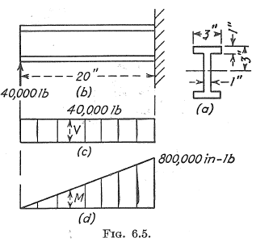
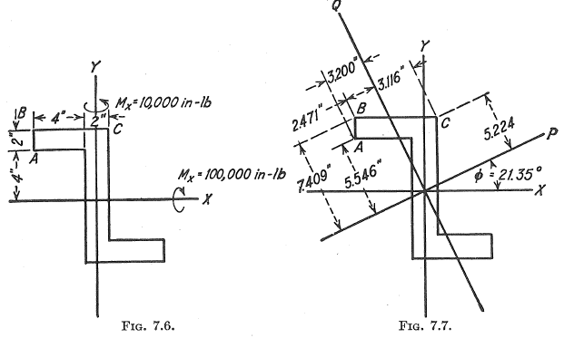

.. _label-testing:

Validation
==========

``sectionproperties`` has a growing suite of tests. The testing suite serves to
verify functionality and find exceptions from edge cases, but also validate the results
against known cases. Most importantly, it ensures that whenever any changes are made to
the code base, the expected output is preserved. Further, since this library performs
engineering calculations, it should have some manner of proving its accuracy. Each
analyst who uses it is responsible for their own projects and calculations, but having a
high level of confidence that the software can produce *correct* results,
*given the correct inputs*, is beneficial to all users. Some test results and
explanations from the latter category will be outlined on this page.

Textbook Examples
-----------------

An obvious starting location is replicating examples from academic texts. The main
reference text for ``sectionproperties`` is "Analysis and Design of Elastic Beams" by
Walter D. Pilkey [Pilkey]_. This text contains several examples and validation tests
which are covered in the testing suite, see
`source <https://github.com/robbievanleeuwen/section-properties/blob/master/tests/validation/test_pilkey.py>`_.
Selected validation tests from [Pilkey]_ are found in the examples section of the
documentation, notably the :ref:`/examples/validation/pilkey_channel.ipynb`,
:ref:`/examples/validation/pilkey_arc.ipynb` and :ref:`/examples/validation/pilkey_composite.ipynb`
examples.

"Aircraft Structures" by David J. Peery is also a highly regarded text in the
field of aerospace structures [Peery]_. Several examples from [Peery]_ are described
below, and can also be found in the :ref:`/examples/validation/peery.ipynb` example.

Peery - Symmetric Sections
~~~~~~~~~~~~~~~~~~~~~~~~~~

The simplest example of a realistic section problem is the symmetric I-Beam, with a
free-fixed boundary condition and a transverse tip load. The free-body-diagram and shear
and moment diagrams are shown in the problem statement, referenced below. This problem
is Example 1 in Section 6.2.

Check #1
^^^^^^^^

In ``sectionproperties``, there are multiple ways to set this problem up. We could
different shapely geometries and merge together, or a set of custom points, or a
built-in constructor. For the sake of simplicity, this simpler I-section is identical to
the Nastran I-section definition, so it makes sense to utilise the built-in constructor
from :func:`~sectionproperties.pre.library.nastran_sections.nastran_i`.

Using an arbitrarily coarse mesh, the properties can then be directly calculated from
the class method
:meth:`~sectionproperties.analysis.section.Section.calculate_geometric_properties`.

Peery lists the second moment of area about the primary bending axis as a value of 43.3
in\ :sup:`4`. For the automated tests in this library, we check against this hardcoded
value, with a tolerance of :math:`\pm 0.1`\ %.

Check #2
^^^^^^^^

As a final check against this example, we can calculate the maximum bending stress on
the I-beam. From simple statics, the maximum moment from the FBD will be 800,000
in-lbs at the fixed end. Applying this moment to our section from before will allow
computation of stress over the FEM.

Peery quotes the peak value at 55.5 ksi, which is rounded to the nearest decimal
place. From the equatio listed in the text, the theoretical value is actually 55,427.3
psi.

.. math::
  f = \frac{My}{I} = 55,427.3 = 55,400

Again, the automated test against this checks the hardcoded value with a tolerance of
:math:`\pm 0.1`\ %. For accuracy, 55,427.3 is used instead of the rounded value.

For full details and the most updated code of this example, see the
:ref:`/examples/validation/peery.ipynb` example. For the exact test code execution,
check the
`source <https://github.com/robbievanleeuwen/section-properties/blob/master/tests/validation/test_peery.py>`_.

Peery - Unsymmetric Sections
~~~~~~~~~~~~~~~~~~~~~~~~~~~~

For a more complex example, we can turn to Example 1 in Section 7.2 of Peery. Here, we
have a still-simplified Z-section, but bending about two axes. Note axes definitions in
the problem statement. Beam axial direction in ``sectionproperties`` is always
referenced as the z-axis, and loads must be applied in this coordinate system.

The construction of this geometry takes a similar approach to Ex 6.2.1, and utilises a
built-in factory, :func:`~sectionproperties.pre.library.nastran_sections.nastran_zed`.
The only difference you may notice in the test code is usage of a custom class for ease
of initialisation. This is not necessary.

Using an arbitrarily coarse mesh, the properties can then be directly calculated from
the class method
:meth:`~sectionproperties.analysis.section.Section.calculate_geometric_properties`.
Each property listed directly by Peery is taken as a hardcoded value and checked
against, within the testing suite.

+---------------+--------------------------+
|   Property    |   Peery Value            |
+===============+==========================+
|  I_x          |   693.3 [in\ :sup:`4`]   |
+---------------+--------------------------+
|  I_y          |   173.3 [in\ :sup:`4`]   |
+---------------+--------------------------+
|  I_xy         |   -240  [in\ :sup:`4`]   |
+---------------+--------------------------+
|  I_p          |   787.1 [in\ :sup:`4`]   |
+---------------+--------------------------+
|  I_q          |    79.5 [in\ :sup:`4`]   |
+---------------+--------------------------+
|  theta        |   21.35 [deg]            |
+---------------+--------------------------+

For stress results, the theoretical values follow the biaxial bending equation. These
values are checked against automatically in the testing suite. Note that again Peery
rounds the values quoted directly, for simplicity. The testing suite also verifies that
the theoretical value as per the equation matches the theoretical value quoted in the
text, which also matches the computed value from the ``sectionproperties`` FEM.

.. math::
    f_b = \frac{M_x I_{xy} - M_y I_x}{I_x I_y - I_{xy}^2}x +
          \frac{M_y I_{xy} - M_x I_y}{I_x I_y - I_{xy}^2}y

+---------+-----+-----+---------+---------+----------------------+
|  Point  |  x  |  y  |  -494x  |  -315y  |  :math:`f_b`, [psi]  |
+=========+=====+=====+=========+=========+======================+
|   A     | -5  |  4  |  2470   |  -1260  |  1210.0 = 1210       |
+---------+-----+-----+---------+---------+----------------------+
|   B     | -5  |  6  |  2470   |  -1890  |  580.0 = 580         |
+---------+-----+-----+---------+---------+----------------------+
|   C     |  1  |  6  |  -494   |  -1890  |  -2384.0 = -2380     |
+---------+-----+-----+---------+---------+----------------------+

.. figure:: ../_static/validation/peery_7-2-1_2.png
  :width: 40%
  :alt: From Peery, Sec. 7.2 Example 1 results
  :align: center

For full details and the most updated code of this example, see the
:ref:`/examples/validation/peery.ipynb` example. For the exact test code execution,
check the
`source <https://github.com/robbievanleeuwen/section-properties/blob/master/tests/validation/test_peery.py>`_.

References
----------

.. [Pilkey] W. D. Pilkey, *Analysis and Design of Elastic Beams: Computational Methods*,
    John Wiley & Sons, Inc., New York, 2002.

.. [Peery] D. J. Peery, *Aircraft Structures.* New York: Dover Publications, 2011.
    ISBN-10: 0-486-48580-3
